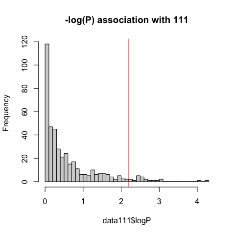
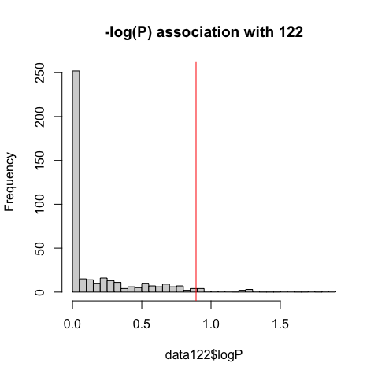
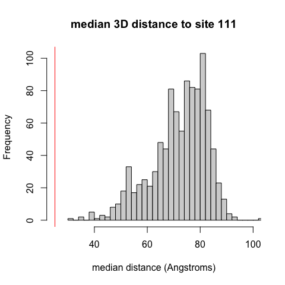
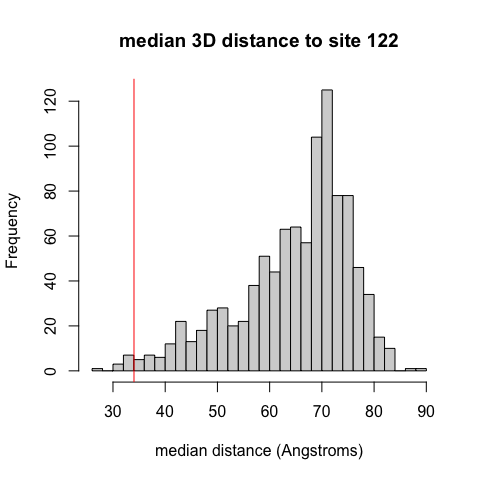

Bayes Traits anlysis
================
Santiago Herrera
2023-04-22

Functions
---------

``` r
# imports a fasta-formatted alignment and converts it into a matrix
import_alignment <- function(dir) {
  
  fasta <- readLines(dir)
  
  taxa <- fasta[2L * (1L:(length(fasta) / 2L)) - 1L]
  taxa <- sub('>', '', taxa)
  
  sequences <- fasta[2L * (1L:(length(fasta) / 2L))]
  sequences <- t(vapply(strsplit(sequences, split = ''), identity, character(nchar(sequences[1L]))))
  rownames(sequences) <- taxa
  
  sequences
}

# This function fills with "0" or "1" an alignment matrix (e.g.,'aln_BT') depending on whether the state is the same as the 
# ancestral state ("0") or different ("1") for each ATP1A paralog.
build_aln <- function(seq_name,paralog,matrix_aln){
  #subset alignment based on ATP1A paralog
  aln_p <- NULL
  if(paralog == 1) aln_p <- aln[grep("A1",rownames(aln)),]
  else if(paralog == 2) aln_p <- aln[grep("A2",rownames(aln)),]
  else if(paralog == 3) aln_p <- aln[grep("A3",rownames(aln)),]
  
  print(paste("sub alignment for paralog: ",paralog,". Number of seqs: ",dim(aln_p)[1]))
  
  for(i in 1:dim(seq_name)[2]){
    anc_state_i <- seq_name[1,i]
    for(j in 1:dim(aln_p)[1]){
      if(anc_state_i == aln_p[j,i] && aln_p[j,i] != "-") {
        #if state i in extant seq is the same as state i in acestral sequence = 0
        matrix_aln[which(rownames(matrix_aln)==rownames(aln_p)[j]),i] <-  0
      }
      if(anc_state_i != aln_p[j,i] && aln_p[j,i] != "-") {
        #if state i in extant seq is different from state i in acestral sequence = 1
        matrix_aln[which(rownames(matrix_aln)==rownames(aln_p)[j]),i] <-  1
      }
    }
  }
  matrix_aln
}

## Generate data files with all possible pairs with sites 111 and 122
# Exports a file containing AA states at 111/122 and every other variable site
pairs <- function(site1,aln_matrix,folder){
  for(i in 1:dim(aln_matrix)[2]){
    site2 <- colnames(aln_matrix)[i]
    pair <- aln_matrix[,colnames(aln_matrix) %in% c(site1,site2)]
    write.table(pair,file=paste(folder,"/",site1,"_",site2,".txt",sep=""), quote = F, sep = "\t",col.names = F)
  }
}

#Function to match alignment position to sheep A1 site number (see "A1_AA_alignment_convergence_modified_PA_codeml.fasta")
##  Blocks of alignment PA trimmed      Complete alignment   
##  1                   1 - 15          14 - 28               1 : 1
##  2                   16 - 24         29 - 47               Not 1 : 1
##  3                   25 - 114        48 - 137              1 : 1
##  4                   115 - end       139 - end             1 : 1

match_site <- function(table){
  sites <- c()
  ## e.g. outliers table
  for(i in 1:dim(table)[1]){
    position <- table[i,8]
    site <- NA
    if(position >= 14 && position <= 28) site <- position - 13
    if(position >= 48 && position <= 137) site <- position - 23
    if(position >= 139) site <- position - 24
    sites <- c(sites,site)
  }
  return(sites)
}
```

Import data
-----------

``` r
# Codeml output tree: tree with annotated nodes (from `rst` file)
tree_asr <- ape::read.tree("../data/codeml/asr_codeml__nodes_tree.tre") 
nodes <- tree_asr$node.label

# `rst` file
rst_file <- "../data/codeml/rst.gz"

# Import ancestral sequences and posterior probabilities distributions
f1 <- file.path("..", "data", "convergence", "anc_seqs_atp1-3_codeml.csv")
f2 <- file.path("..", "data", "convergence", "pps_anc_seqs_atp1-3_codeml.csv")
if(!file.exists(f1) & !file.exists(f2)) {
  asr <- import_ancestral_sequences(rst_file,nodes)
  aln_anc <- asr[[1]]
  pps_per_site_anc <- asr[[2]]
  
  write.csv(aln_anc,f1,quote = F)
  write.csv(pps_per_site_anc,f2,quote = F)
} else {
    aln_anc <- read.csv(f1,h=TRUE,colClasses="character",row.names = 1)
    rownames(aln_anc) <- paste("node_",rownames(aln_anc),sep="")
    pps_per_site_anc <- read.csv(f2,row.names = 1)
}

# Import alignment of extant sequences
alignment <- "../data/alignments/A1-A3_AA_alignment_convergence_modified_codeml.fasta"
aln <- import_alignment(alignment)
colnames(aln) <- colnames(aln_anc)

# Merge ancestral and extant alignments
anc_extant_align <- rbind(aln,aln_anc)
rownames(anc_extant_align) <- gsub("(lungfish|fish|caecilian|frog|lizard|snake|bird|crocodilian|mammal|turtle)(\\.)","\\1|",rownames(anc_extant_align)) %>%
  gsub("_A1.1","_A1_2",.)

# Import phylogenetic tree
tree<-read.tree("../data/convergence/codeml_brlens_tree.tre")
edges <- as.data.frame(tree$edge) # matrix with edges: anc --> desc nodes
colnames(edges) <- c("anc_node","descendant_node")
```

Set up alignment for BayesTraits
--------------------------------

Using the inferred ancestor sequences, we will binarize each amino acid state in the multi-species alignment into ancestral, ‘0’, and derived, ‘1’, states. We will use this recoded alignment and the phylogeny with branch lengths as the input for 'BayesTraits'.

``` r
### Set the alignment

# Extract reference sequences for each reconstructed ancestral paralog
# Using asr_codeml__nodes_tree.tre:
# ancestral node for ATP1A1: 833
# ancestral node for ATP1A2: 835
# ancestral node for ATP1A3: 1031

anc_A1 <- aln_anc[row.names(aln_anc)=="node_833",]
anc_A2 <- aln_anc[row.names(aln_anc)=="node_835",]
anc_A3 <- aln_anc[row.names(aln_anc)=="node_1031",]

# Alignment for BayesTraits: intialize with all 0
aln_BT <- matrix(nrow=dim(aln)[1], ncol=dim(aln)[2])
colnames(aln_BT) <- colnames(aln)
rownames(aln_BT) <- rownames(aln)

aln_BT_a1 <- build_aln(seq_name = anc_A1,paralog = 1, matrix_aln = aln_BT)
aln_BT_a2 <- build_aln(seq_name = anc_A2,paralog = 2, matrix_aln = aln_BT_a1)
aln_BT_final <- build_aln(seq_name = anc_A3,paralog = 3, matrix_aln = aln_BT_a2)

# Excluding sites with a single substitution or >80% gaps
filter_aln <- function(matrix_aln){
  sites <- c()
  for(i in 1:dim(matrix_aln)[2]){
    if(sum(is.na(matrix_aln[,i])) >= 1){
      if(sum(is.na(matrix_aln[,i]))/dim(matrix_aln)[1] >= 0.8) sites <- c(sites,i)
    }
    if(sum(matrix_aln[,i], na.rm = T) <= 1) sites <- c(sites,i)
  }
  print(sites)
  matrix_aln <- matrix_aln[,-sites]
}

filt_aln_BT <- filter_aln(aln_BT_final)
filt_aln_BT[is.na(filt_aln_BT)] <- "-"

#check that tree tips and seq names match
rownames(aln)[!(rownames(aln) %in% tree$tip.label)]
tree$tip.label[!(tree$tip.label %in% rownames(aln))]

#exported rooted tree (on node 834, ATP1A3 as 'outgroup') in nexus
rooted <- ape::root(tree,node=834,resolve.root = TRUE)
phytools::writeNexus(rooted,file="./codeml_brlens_tree_rooted_nexus.tre")
```

Create files for BayesTraits
----------------------------

Export alignment files for every pair of sites with 111 or 122. Use the files generated here to run the `run_BayesTraits_parallel.sh` script provided in the `data/BayesTraits` folder.

``` r
# site 111
folder111 ="./site111_pairs"
pairs(site1 = "V134",aln_matrix = filt_aln_BT, folder = folder111)

# site 122
folder122 ="./site122_pairs"
pairs(site1 = "V146",aln_matrix = filt_aln_BT, folder = folder122)
```

Parse BayesTraits results
-------------------------

Here we will parse the outputs generated by the `run_BayesTraits_parallel.sh` script, and compute the LRS and p-values for each site pair.

``` r
## output from BayesTraits comparing null (independent) model vs. alternative (dependent) model with 
## rates of transition to the ancestral state restrcticted to zero.
## Number of parameters Null: 4 rate parameters ('null_discrete_independent_restricted_rates.txt')
## number of parameters Alt: 2 rate parameters ('alt_discrete_dependent_restricted_rates.txt')

##BayesTraits pairs: site 111
data111 <- read.table("../data/BayesTraits/s111_out_BT_restricted_rates_rootedTree.txt")
colnames(data111) <- c("file","LnL_null","LnL_alt")
LRS <- c()
pval <- c()
for(i in 1:dim(data111)[1]){
  #LRS = 2*(unrestricted model – restricted model)
  LRS <- c(LRS,(2*((data111[i,2]-data111[i,3]))))
  pval <- c(pval,pchisq(q=(2*((data111[i,2]-data111[i,3]))),df=2,lower.tail = F))
}
data111$LRS <- LRS
data111$pval <- pval
data111$pval_bonf <- p.adjust(p = data111$pval,method = "bonferroni")
data111$logP <- -log10(data111$pval)
data111$alignment_pos <-  as.numeric(stringr::str_extract(data111$file,"(_V[0-9]+\\.)") %>% gsub("_","",.) %>% gsub("\\.","",.) %>%
  gsub("V","",.))

#hist(data111$LRS,breaks = 50)
#abline(v=qchisq(0.05,df=2,lower.tail = F),col="red")

hist(data111$logP,breaks = 50,main="-log(P) association with 111")
abline(v=quantile(data111$logP,0.95),col="red")
```



``` r
##BayesTraits pairs: site 122
data122 <- read.table("../data/BayesTraits/s122_out_BT_restricted_rates_rootedTree.txt")
colnames(data122) <- c("file","LnL_null","LnL_alt")
LRS <- c()
pval <- c()
for(i in 1:dim(data122)[1]){
  #LRS = 2*(unrestricted model – restricted model)
  LRS <- c(LRS,(2*((data122[i,2]-data122[i,3]))))
  pval <- c(pval,pchisq(q=(2*((data122[i,2]-data122[i,3]))),df=2,lower.tail = F))
}
data122$LRS <- LRS
data122$pval <- pval
data122$pval_bonf <- p.adjust(p = data122$pval,method = "bonferroni")
data122$logP <- -log10(data122$pval)
data122$alignment_pos <-  as.numeric(stringr::str_extract(data122$file,"(_V[0-9]+\\.)") %>% gsub("_","",.) %>% gsub("\\.","",.) %>%
  gsub("V","",.))

#hist(data122$LRS,breaks = 50)
#abline(v=qchisq(0.05,df=2,lower.tail = F),col="red")

hist(data122$logP,breaks = 50,main="-log(P) association with 122")
abline(v=quantile(data122$logP,0.95),col="red")
```



``` r
# Export results
# write.table(data111,"../data/BayesTraits/data111_BT_restrictedModels_allParalogs")
# write.table(data122,"../data/BayesTraits/data122_BT_restrictedModels_allParalogs")

# Extract outliers
outliers111 <- data111[(data111$logP > quantile(data111$logP,0.95)),]
outliers122 <- data122[(data122$logP > quantile(data122$logP,0.95)),]
```

3D spatial clustering analyses of outliers
------------------------------------------

Map outlier sites coevolving with 111 or 122 onto the 3D structure of the ATPase (`PDB: 3b8e`). Use the data frame containing the 3D spatial distances between all sites pairs with 111 or 122 (output of `data/pymol/3D_pairwise_distance.py` script). The distances are calculated as the euclidean distance between alpha carbons of each amino acid.

``` r
# Match sites with sheep reference sequence positions
data111$site <- match_site(data111)
data122$site <- match_site(data122)

outliers111$site <- match_site(outliers111)
outliers122$site <- match_site(outliers122)

## Spatial enrichment analysis: using the pairwise distance in 3D structre between each pair, 
## check whether top 5% sites are clustered in space. 

spatial_df_111 <- read.table("../data/pymol/distance_pairs111_3b8e.out",header = TRUE) %>% .[!is.na(.$distance),]
spatial_df_122 <- read.table("../data/pymol/distance_pairs122_3b8e.out",header = TRUE) %>% .[!is.na(.$distance),]

spatial_df_111$site <- spatial_df_111$site2
spatial_df_122$site <- spatial_df_122$site2

## combine BayesTraits output with spatial information for each site
spatial_BT_111top5 <- inner_join(outliers111,spatial_df_111,by="site")
spatial_BT_122top5 <- inner_join(outliers122,spatial_df_122,by="site")

spatial_BT_111 <- inner_join(data111,spatial_df_111,by="site")
spatial_BT_122 <- inner_join(data122,spatial_df_122,by="site")

## Perform spatial enrichment analysis:
# 1. Calculate median distance to 111 of sites in top 5% of p-values
# 2. Randomly re-sample the same number of sites from all of those used in the BayesTraits analysis  and calculate the median distance to 111
# 3. Repeat sampling 1000X and ask, what proportion of the time you get a median < or = to the median for the top 5%

spatial_enrichment <- function(df,outlier_df){
  #median distance to focal site in outliers
  med_dist <- median(outlier_df$distance)
  bootstrap_distances <- c()
  for(i in 1:1000){
    sites <- sample(df$site,size = dim(outlier_df)[1],replace = TRUE)
    t2 <- df[(df$site %in% sites),]
    bootstrap_distances <- c(bootstrap_distances, median(t2$distance))
  }
  pval <- sum(bootstrap_distances <= med_dist)/length(bootstrap_distances)
  print(paste("median distance of top 5% sites to site: ", med_dist," | Pval = ",pval))
  return(bootstrap_distances)
}

null_dist_111 <- spatial_enrichment(spatial_BT_111,spatial_BT_111top5)
```

    ## [1] "median distance of top 5% sites to site:  25.1018445  | Pval =  0"

``` r
null_dist_122 <- spatial_enrichment(spatial_BT_122,spatial_BT_122top5)
```

    ## [1] "median distance of top 5% sites to site:  34.0234085  | Pval =  0.011"

``` r
# Plot results:
hist(null_dist_111,main="median 3D distance to site 111",breaks = 30,xlab="median distance (Angstroms)",
     xlim=c(25,100))
abline(v=25.1018445,col="red")
```



``` r
hist(null_dist_122,main="median 3D distance to site 122",breaks = 30,xlab="median distance (Angstroms)")
abline(v=34.0234085,col="red")
```


