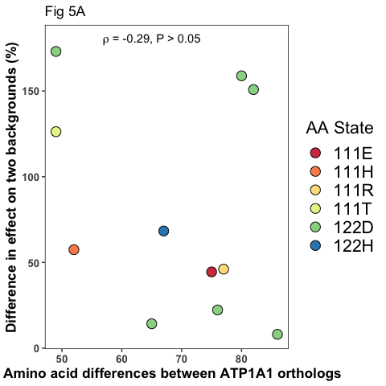
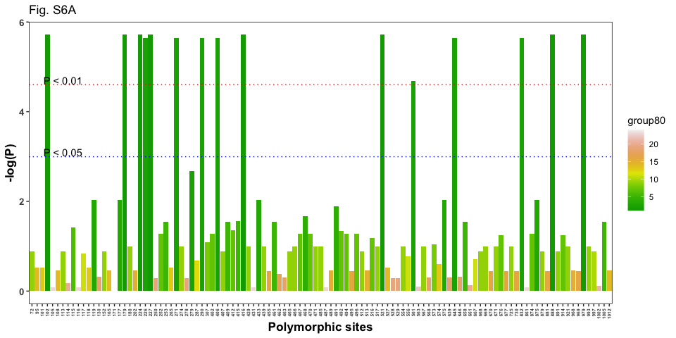
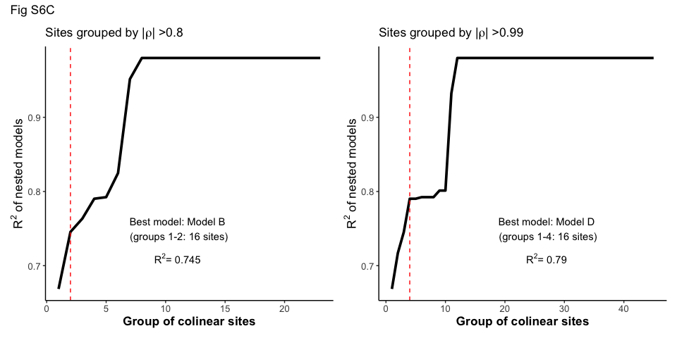
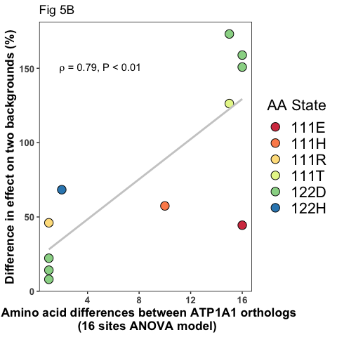
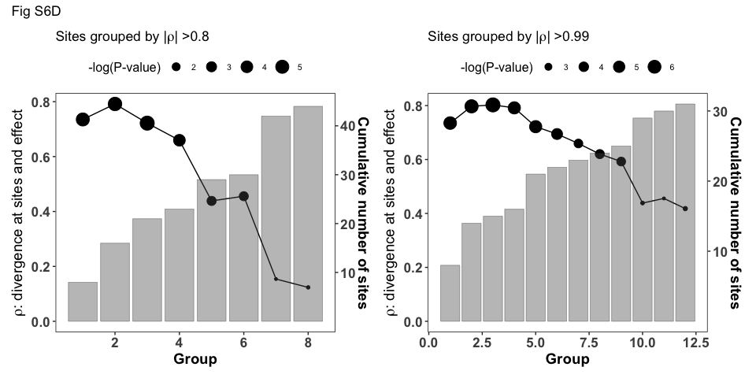

Epistasis analysis with Tegu+Q111T correction
================
Santiago Herrera
2023-04-25

This script has the analyses performed in fig 5. pertaining the finding that a small number of sites account for a large proportion of the differences in pleiotropic effects of the same substitution on divergent ATP1A1 backgrounds.

**Note**: This analysis includes the corrected version of the 'TEG+Q111T' construct. **Results DON'T change**.

## Corrected experimental dataset

Supplementary figures with experimental characterization of ATPase constructs, including the corrcted 'TEG+Q111T' construct.


*Figure S4.* Joint functional properties of 24 engineered Na,K-ATPases (NKAs) from eight vertebrate species. This corrected version contains the new functional data for TEG+111T. See main text for details.


*Figure S5.* Western blot analysis of Na,K-ATPase with engineered *α*-subunits produced in this study. This corrected version contains the new western blots for TEG+Q111T. See main text for details.

Below are the analyses including the corrected version of the TEG+111T construct.

## Functions

``` r
# imports a fasta-formatted alignment and converts it into a matrix
import_alignment <- function(dir) {
  
  fasta <- readLines(dir)
  
  taxa <- fasta[2L * (1L:(length(fasta) / 2L)) - 1L]
  taxa <- sub('>', '', taxa)
  
  sequences <- fasta[2L * (1L:(length(fasta) / 2L))]
  sequences <- t(vapply(strsplit(sequences, split = ''), identity, character(nchar(sequences[1L]))))
  rownames(sequences) <- taxa
  
  sequences
}

# Filter an alignment matrix to include only certain taxa and sites
filter_alignment_by_taxa_and_sites <- function(taxa,sites,aln){
  m <- aln[row.names(aln) %in% taxa,]
  s <- sapply(sites, function(x) paste0("V",x))
  m2 <- m[,colnames(m) %in% s]
  return(m2)
}

# For two taxa get the number (and percentage) of amino acid differences
get_pairwise_dist <- function(aln,df){
  aa_dist <- c()
  perc_dist <- c()
  for(i in 1:dim(df)[1]){
    t <- c(df[i,3],df[i,4])
    a <- aln[row.names(aln) %in% t,]
    diffs <- 0
    for(j in 1:dim(a)[2]){
      if(a[1,j] != a[2,j]) diffs <- diffs + 1
    }
    aa_dist <- c(aa_dist,diffs)
    perc_dist <- c(perc_dist,((diffs/dim(a)[2])*100))
  }
  return(list(aa_dist,perc_dist))
}

# Creates a matrix with recoded states as 0 or 1 depending on whether a pairwise construct comparison have the same or different amino acid state at that site, respectively.
linear_model_matrix <- function(aln,df){
  
  matrix_lm <- matrix(data = NA,nrow = dim(df)[1],ncol = dim(aln)[2]+2)
  effects <- df[,8] # Y values for ANOVA
  covariate <- df[,10] # covariate to correct ANOVA
  matrix_lm[,1] <- effects
  matrix_lm[,2] <- covariate
  
  # For every site in alignment:
  for(i in 1:dim(aln)[2]){
    # If site has no variation in alignment, continue to next site:
    if(length(unique(aln[,i])) == 1) next
    
    # If more than 50% of taxa have gaps at that site, continue to next site:
    if(sum(aln[,1]=="-")/length(aln[,i]) > 0.5) next
    
    aa_states <- c()
    
    # For every pairwise construct comparison:
    for(j in 1:dim(df)[1]){
      t <- c(df[j,3],df[j,4])
      a <- aln[row.names(aln) %in% t, i]  # sub-alignment: compare single variable site amongst two taxa
      # Is the amino acid state the same? --> Recode states as binary (0 or same, and 1 or diff.) to increase statistical power
      if(a[1] == a[2])  aa_states <- c(aa_states,0)
      if(a[1] != a[2])  aa_states <- c(aa_states,1)
    }
    
    # Check points to ensure there's enough power and observations to perform an ANOVA:
      # If site has the same recoded state amongst focal taxa, continue (either all states are the same, or all states are different).
      # If only one observation in either recoded binary state, continue.
    if(length(unique(aa_states)) == 1) next
    if(table(aa_states)[1] < 2) next
    if(table(aa_states)[2] < 2) next
    matrix_lm[,i+2] <- as.numeric(aa_states) # save recoded states to matrix
  }
  matrix_lm <- as.data.frame(matrix_lm)
  colnames(matrix_lm) <- c("effect","covariate",sapply(seq(1,dim(aln)[2],1), function(x) paste0("V",x)))
  
  matrix_lm <- matrix_lm[ , colSums(is.na(matrix_lm)) == 0]
  return(matrix_lm)
}

# This function performs an ANOVA for every variant site between the functional constructs.
anova_per_site <- function(mat){
  # mat: a matrix with amino states recoded. (output of `joint_linear_model_matrix` function)
  
  position <- c()
  effects <- mat[,1] # Y values for ANOVA
  covariate <- mat[,2] # covariate to correct ANOVA
  pvals <- c()
  Fvals <- c()
  R2 <- c()
  
  for(i in 3:dim(mat)[2]){
    # Do ANOVA at site i
    aa_states <- as.factor(mat[,i])
    m <- aov(effects~covariate+aa_states)
    p <- summary(m)[[1]][["Pr(>F)"]][2]
    f <- summary(m)[[1]][["F value"]][2]
    r2 <- summary(m)[[1]][["Sum Sq"]][2]/(summary(m)[[1]][["Sum Sq"]][1]+summary(m)[[1]][["Sum Sq"]][2]+summary(m)[[1]][["Sum Sq"]][3])
    position <- c(position,colnames(mat)[i])
    pvals <- c(pvals,p)
    Fvals <- c(Fvals,f)
    R2 <- c(R2,r2)
  }
  df <- data.frame(position,Fvals,R2,pvals)
  df$site <- match_site(df)
  return(df)
}

#Function to match alignment position to sheep A1 site number (see "A1_AA_alignment_convergence_modified_PA_codeml.fasta")
##  Blocks of alignment PA trimmed      Complete alignment   
##  1                   1 - 15          14 - 28               1 : 1
##  2                   16 - 24         29 - 47               Not 1 : 1
##  3                   25 - 114        48 - 137              1 : 1
##  4                   115 - end       139 - end             1 : 1

match_site <- function(table){
  sites <- c()
  for(i in 1:dim(table)[1]){
    position <- as.numeric(table[i,1] %>% gsub("V","",.))
    site <- NA
    if(position >= 14 && position <= 28) site <- position - 13
    if(position >= 48 && position <= 137) site <- position - 23
    if(position >= 139) site <- position - 24
    sites <- c(sites,site)
  }
  return(sites)
}

# Extract R^2 from a linear model
get_R2 <- function(model){
  ss_cov <- summary(model)[[1]][["Sum Sq"]][1]
  ss_res <- tail(summary(model)[[1]][["Sum Sq"]],1)
  ss_factors <- summary(model)[[1]][["Sum Sq"]][-c(which(summary(model)[[1]][["Sum Sq"]]==ss_cov),which(summary(model)[[1]][["Sum Sq"]]==ss_res))]
  R2 <- sum(ss_factors)/sum(summary(model)[[1]][["Sum Sq"]]) 
  R2
}

# Extract adjusted R^2 from a linear model (Adjusted R2 also indicates how well terms fit a curve or line, but adjusts for the number of terms in a model.)
adj_R2 <- function(model){
  n <- length(model$model$effect)
  k <- model$rank-1
  adjr2 <- 1-(((1-get_R2(model))*(n-1))/(n-k-1))
  adjr2
} 
```

## Import data

``` r
# Import alignment of extant sequences
alignment <- "../data/alignments/A1-A3_AA_alignment_convergence_modified_codeml.fasta"
aln <- import_alignment(alignment)
colnames(aln) <- sapply(seq(1,1040,1), function(x) paste0("V",x))

# Import *corrected* dataset with the pairwise construct comparisons (Distance and Perc_dist refer to the full protein)
df_effect <- read.csv("../data/mut_effects/Percent_change_shared_derived_state_corrected.csv",header = T)

# Names of taxa with functional information (use to make sub-alignmentes)
taxa <- c("bird|Struthio_camelus_A1","frog|Leptodactylus_macrosternumS_A1","mammal|Rattus_norvegicus_A1",
          "snake|Xenodon_rhabdocephalus_A1","lizard|Tupinambis_teguxin_A1","lizard|Varanus_exanthemathicus_A1",
          "snake|Rhabdophis_subminiatus_A1","mammal|Chinchilla_lanigera_A1")
```

## A small number of sites account for a large proportion of the differences in pleiotropic effects of the same substitution on divergent ATP1A1 backgrounds (Fig 5)

Relationship between percent change (when change to the same derived amino acid state) and number of amino acid differences for the entire protein.

*Note that the point corresponding to the 111T comparison is lower. Original value: 191.87; corrected value: 126.25*

``` r
# Statistical analyses:
# Correlation between percent change and number of amino acid differences for the entire protein 
cor.test(df_effect$Distance,df_effect$PercentDiff)
```

    ## 
    ##  Pearson's product-moment correlation
    ## 
    ## data:  df_effect$Distance and df_effect$PercentDiff
    ## t = -0.91752, df = 9, p-value = 0.3828
    ## alternative hypothesis: true correlation is not equal to 0
    ## 95 percent confidence interval:
    ##  -0.7591531  0.3728169
    ## sample estimates:
    ##        cor 
    ## -0.2924663

``` r
# Plot
my_pallette <- brewer.pal(6,"Spectral")

ggplot(df_effect,aes(x=Distance,y=PercentDiff),color=AAState) + 
  geom_point(size=4,shape=21,aes(fill = AAState)) +
  scale_fill_manual(values = my_pallette) +
  labs(x="# Amino acid differences between ATP1A1 orthologs",y="Difference in effect on two backgrounds (%)",fill="AA State") +
  theme(
    panel.background = element_rect(fill = "white",colour = "white"),
    panel.border = element_rect(linetype = 1, fill = NA),
    panel.grid.major = element_line(),
    axis.text.x = element_text(face="bold", size=10),
    axis.text.y = element_text(face="bold", size=10), 
    axis.title = element_text(face="bold", size=13),
    legend.box.background = element_blank(),
    legend.key = element_rect(fill = "white"),
    legend.text = element_text(size=16),
    legend.title = element_text(size=16)) +
  annotate("text",x=65,y=180,label=expression(paste(rho, " = -0.29, P > 0.05"))) + ggtitle("Fig 5A")
```



### ANOVA per site

Here we will perform an ANOVA for every variable site in the wild-type sequence amongst the constructs with functional data.

``` r
# Add covariate to functional data frame: which site is being mutated
df_effect$covariate <- gsub("[A-Z]","",df_effect$AAState)

# Make sub-alignment (Taxa with functional data and full ATP1A1 sequence)
constructs_aln <- filter_alignment_by_taxa_and_sites(taxa,seq(1,dim(aln)[2],1),aln)

# Build recoded matrix
matrix_anova <- linear_model_matrix(constructs_aln,df_effect) 

# Remove polymorphic positions within the first 68 sites of the alignment (poor alignment quality) and sites 111 and 122.
sites_to_remove <- c("V1","V2","V9","V10","V12","V14","V15","V16","V17","V19","V20","V21","V22","V23","V25","V26","V27","V28","V29","V30","V31","V32","V33","V34","V35","V36","V43","V44","V45","V46","V48","V56","V57","V62","V63","V69","V76","V80","V134","V146")
matrix_anova <- matrix_anova[, !(colnames(matrix_anova) %in% c(sites_to_remove))]

# Perform ANOVA per site 
df_anova <- anova_per_site(matrix_anova) 
df_anova$LogP <- -log(df_anova$pvals)
df_anova <- df_anova[!(is.na(df_anova$site)),] # remove sites that have unclear match to reference sequence
```

### The extent of correlation among variant sites distinguishing wild-type ATP1A1 constructs (Fig S6)

Because we have relatively few construct comparisons relative to the number of variable sites, some sites have strong correlations between constructs (i.e., they show the same pattern of variation, therefore have the same signal).

*Note: Groupping assignments of sites change relative to the original analysis, but the trend remains the same*

``` r
# Build correlation matrix amogst sites based on their variation pattern amongst constructs
matrix_sites_only <- matrix_anova[,!(colnames(matrix_anova) %in% c("effect","covariate"))]
matrix_sites_only[] <- sapply(matrix_sites_only,as.numeric)
cor_matrix <- cor(matrix_sites_only)
cor_matrix[!lower.tri(cor_matrix)] <- 0 # Set upper diagonal to zero

# Plot absolute correlation between sites to show clusters of highly colinear sites
pheatmap(abs(cor(matrix_sites_only)),cluster_rows = T, border_color="black",fontsize_row=3,fontsize_col=3,cellheight=2,main = "Clusters of polymorphic sites (Fig S6B)")
```


``` r
# Remove highly colinear variables (sites with an absolute correlation > 0.8)
matrix_anova_indep_1 <- matrix_sites_only[, !apply(cor_matrix, 2, function(x) any(abs(x) > 0.8, na.rm = TRUE))] # Selects an arbritary site as representatives
matrix_anova_indep_1$effect <- matrix_anova$effect
matrix_anova_indep_1$covariate <- matrix_anova$covariate

# Remove highly colinear variables (sites with an absolute correlation > 0.99)
matrix_anova_indep_2 <- matrix_sites_only[, !apply(cor_matrix, 2, function(x) any(abs(x) > 0.99, na.rm = TRUE))]
matrix_anova_indep_2$effect <- matrix_anova$effect
matrix_anova_indep_2$covariate <- matrix_anova$covariate

# Sort ANOVA results by the marginal R^2
df_anova <- arrange(df_anova,desc(R2))

# Add group category to sites: grouped by the cluster they belong to
group_sites1 <- matrix_anova_indep_1 %>% select(-c(effect,covariate)) %>% with(colnames(.))
group_sites1 <- group_sites1[order(match(group_sites1,df_anova$position[which(df_anova$position %in% group_sites1)]))] # order representative sites based on R2
group1 <- seq(1,length(group_sites1),1)
group_sites1 <- data.frame(position=group_sites1,group80=group1)

group_sites2 <- matrix_anova_indep_2 %>% select(-c(effect,covariate)) %>% with(colnames(.))
group_sites2 <- group_sites2[order(match(group_sites2,df_anova$position[which(df_anova$position %in% group_sites2)]))] # order representative sites based on R2
group2 <- seq(1,length(group_sites2),1)
group_sites2 <- data.frame(position=group_sites2,group99=group2)

df_anova <- df_anova %>% full_join(.,group_sites1,by="position") %>% full_join(.,group_sites2,by="position") %>% fill(group80,.direction="up") %>% fill(group99,.direction="up") %>% mutate(group80 = replace_na(group80,24))

# Show ANOVA table with assigned groups
knitr::kable(df_anova)
```

| position |       Fvals|         R2|      pvals|  site|       LogP|  group80|  group99|
|:---------|-----------:|----------:|----------:|-----:|----------:|--------:|--------:|
| V125     |  17.0873560|  0.6686188|  0.0032818|   102|  5.7193733|        1|        1|
| V203     |  17.0873560|  0.6686188|  0.0032818|   179|  5.7193733|        1|        1|
| V248     |  17.0873560|  0.6686188|  0.0032818|   224|  5.7193733|        1|        1|
| V251     |  17.0873560|  0.6686188|  0.0032818|   227|  5.7193733|        1|        1|
| V440     |  17.0873560|  0.6686188|  0.0032818|   416|  5.7193733|        1|        1|
| V545     |  17.0873560|  0.6686188|  0.0032818|   521|  5.7193733|        1|        1|
| V912     |  17.0873560|  0.6686188|  0.0032818|   888|  5.7193733|        1|        1|
| V1003    |  17.0873560|  0.6686188|  0.0032818|   979|  5.7193733|        1|        1|
| V250     |  16.5883103|  0.6622654|  0.0035692|   226|  5.6354198|        2|        2|
| V295     |  16.5883103|  0.6622654|  0.0035692|   271|  5.6354198|        2|        2|
| V314     |  16.5883103|  0.6622654|  0.0035692|   290|  5.6354198|        2|        2|
| V430     |  16.5883103|  0.6622654|  0.0035692|   406|  5.6354198|        2|        2|
| V669     |  16.5883103|  0.6622654|  0.0035692|   645|  5.6354198|        2|        2|
| V856     |  16.5883103|  0.6622654|  0.0035692|   832|  5.6354198|        2|        2|
| V585     |  11.6496839|  0.5819922|  0.0091801|   561|  4.6907122|        2|        3|
| V303     |   4.3975414|  0.3482034|  0.0692566|   279|  2.6699374|        2|        4|
| V143     |   2.8382308|  0.2570679|  0.1305376|   119|  2.0360942|        3|        5|
| V201     |   2.8382308|  0.2570679|  0.1305376|   177|  2.0360942|        3|        5|
| V457     |   2.8382308|  0.2570679|  0.1305376|   433|  2.0360942|        3|        5|
| V599     |   2.8382308|  0.2570679|  0.1305376|   575|  2.0360942|        3|        5|
| V899     |   2.8382308|  0.2570679|  0.1305376|   875|  2.0360942|        3|        5|
| V515     |   2.5353510|  0.2362369|  0.1499872|   491|  1.8972053|        4|        6|
| V492     |   2.0621724|  0.2011832|  0.1889203|   468|  1.6664301|        4|        7|
| V439     |   1.8697082|  0.1859637|  0.2086882|   415|  1.5669138|        5|        8|
| V485     |   1.8400549|  0.1835658|  0.2119826|   461|  1.5512510|        5|        9|
| V277     |   1.8400549|  0.1835658|  0.2119826|   253|  1.5512510|        5|       10|
| V433     |   1.8400549|  0.1835658|  0.2119826|   409|  1.5512510|        5|       10|
| V682     |   1.8400549|  0.1835658|  0.2119826|   658|  1.5512510|        5|       10|
| V1029    |   1.8400549|  0.1835658|  0.2119826|  1005|  1.5512510|        5|       10|
| V139     |   1.6003277|  0.1636370|  0.2414599|   115|  1.4210520|        6|       11|
| V436     |   1.4940521|  0.1544802|  0.2563769|   412|  1.3611067|        7|       12|
| V516     |   1.4493163|  0.1505641|  0.2630471|   492|  1.3354224|        7|       13|
| V276     |   1.3468838|  0.1414562|  0.2792823|   252|  1.2755323|        7|       14|
| V426     |   1.3468838|  0.1414562|  0.2792823|   402|  1.2755323|        7|       14|
| V491     |   1.3468838|  0.1414562|  0.2792823|   467|  1.2755323|        7|       14|
| V494     |   1.3468838|  0.1414562|  0.2792823|   470|  1.2755323|        7|       14|
| V518     |   1.3468838|  0.1414562|  0.2792823|   494|  1.2755323|        7|       14|
| V520     |   1.3468838|  0.1414562|  0.2792823|   496|  1.2755323|        7|       14|
| V898     |   1.3468838|  0.1414562|  0.2792823|   874|  1.2755323|        7|       14|
| V938     |   1.3033630|  0.1375257|  0.2866179|   914|  1.2496054|        7|       15|
| V700     |   1.3033630|  0.1375257|  0.2866179|   676|  1.2496054|        7|       16|
| V540     |   1.1943636|  0.1275186|  0.3062649|   516|  1.1833049|        7|       17|
| V331     |   1.0382370|  0.1127642|  0.3380536|   307|  1.0845507|        8|       18|
| V597     |   0.9713524|  0.1062863|  0.3532087|   573|  1.0406961|        8|       19|
| V204     |   0.9061709|  0.0998798|  0.3690033|   180|  0.9969497|        9|       20|
| V453     |   0.9061709|  0.0998798|  0.3690033|   429|  0.9969497|        9|       20|
| V463     |   0.9061709|  0.0998798|  0.3690033|   439|  0.9969497|        9|       20|
| V490     |   0.9061709|  0.0998798|  0.3690033|   466|  0.9969497|        9|       20|
| V495     |   0.9061709|  0.0998798|  0.3690033|   471|  0.9969497|        9|       21|
| V509     |   0.9061709|  0.0998798|  0.3690033|   485|  0.9969497|        9|       21|
| V541     |   0.9061709|  0.0998798|  0.3690033|   517|  0.9969497|        9|       21|
| V578     |   0.9061709|  0.0998798|  0.3690033|   554|  0.9969497|        9|       21|
| V591     |   0.9061709|  0.0998798|  0.3690033|   567|  0.9969497|        9|       21|
| V693     |   0.9061709|  0.0998798|  0.3690033|   669|  0.9969497|        9|       21|
| V695     |   0.9061709|  0.0998798|  0.3690033|   671|  0.9969497|        9|       21|
| V749     |   0.9061709|  0.0998798|  0.3690033|   725|  0.9969497|        9|       21|
| V945     |   0.9061709|  0.0998798|  0.3690033|   921|  0.9969497|        9|       21|
| V1017    |   0.9061709|  0.0998798|  0.3690033|   993|  0.9969497|        9|       21|
| V298     |   0.9032274|  0.0995883|  0.3697422|   274|  0.9949492|        9|       22|
| V95      |   0.7537607|  0.0845274|  0.4105749|    72|  0.8901968|        9|       23|
| V136     |   0.7537607|  0.0845274|  0.4105749|   113|  0.8901968|        9|       23|
| V176     |   0.7537607|  0.0845274|  0.4105749|   152|  0.8901968|        9|       23|
| V431     |   0.7537607|  0.0845274|  0.4105749|   407|  0.8901968|        9|       23|
| V489     |   0.7537607|  0.0845274|  0.4105749|   465|  0.8901968|        9|       23|
| V536     |   0.7537607|  0.0845274|  0.4105749|   512|  0.8901968|        9|       23|
| V692     |   0.7537607|  0.0845274|  0.4105749|   668|  0.8901968|        9|       23|
| V903     |   0.7537607|  0.0845274|  0.4105749|   879|  0.8901968|        9|       23|
| V915     |   0.7537607|  0.0845274|  0.4105749|   891|  0.8901968|        9|       23|
| V1021    |   0.7537607|  0.0845274|  0.4105749|   997|  0.8901968|       10|       24|
| V141     |   0.6883511|  0.0777734|  0.4307850|   117|  0.8421462|       11|       25|
| V580     |   0.5933384|  0.0677796|  0.4632687|   556|  0.7694480|       11|       26|
| V691     |   0.5210980|  0.0600319|  0.4909317|   667|  0.7114503|       11|       27|
| V311     |   0.4926704|  0.0569470|  0.5026444|   287|  0.6878723|       12|       28|
| V598     |   0.3891562|  0.0455370|  0.5501127|   574|  0.5976320|       13|       29|
| V124     |   0.3046634|  0.0360128|  0.5960517|   101|  0.5174279|       13|       30|
| V142     |   0.3046634|  0.0360128|  0.5960517|   118|  0.5174279|       13|       30|
| V289     |   0.3046634|  0.0360128|  0.5960517|   265|  0.5174279|       13|       30|
| V118     |   0.3038793|  0.0359235|  0.5965163|    95|  0.5166487|       14|       31|
| V551     |   0.3038793|  0.0359235|  0.5965163|   527|  0.5166487|       14|       31|
| V131     |   0.2503101|  0.0297829|  0.6303274|   108|  0.4615160|       14|       32|
| V189     |   0.2503101|  0.0297829|  0.6303274|   165|  0.4615160|       14|       32|
| V1036    |   0.2503101|  0.0297829|  0.6303274|  1012|  0.4615160|       14|       32|
| V226     |   0.2438108|  0.0290324|  0.6347370|   202|  0.4545445|       15|       33|
| V513     |   0.2438108|  0.0290324|  0.6347370|   489|  0.4545445|       15|       33|
| V537     |   0.2438108|  0.0290324|  0.6347370|   513|  0.4545445|       15|       33|
| V992     |   0.2438108|  0.0290324|  0.6347370|   968|  0.4545445|       15|       33|
| V479     |   0.2294924|  0.0273750|  0.6447209|   455|  0.4389377|       16|       34|
| V519     |   0.2294924|  0.0273750|  0.6447209|   495|  0.4389377|       16|       34|
| V694     |   0.2294924|  0.0273750|  0.6447209|   670|  0.4389377|       16|       34|
| V701     |   0.2294924|  0.0273750|  0.6447209|   677|  0.4389377|       16|       34|
| V754     |   0.2294924|  0.0273750|  0.6447209|   730|  0.4389377|       16|       34|
| V905     |   0.2294924|  0.0273750|  0.6447209|   881|  0.4389377|       16|       34|
| V993     |   0.2294924|  0.0273750|  0.6447209|   969|  0.4389377|       16|       34|
| V486     |   0.1795745|  0.0215513|  0.6829030|   462|  0.3814024|       17|       35|
| V670     |   0.1355169|  0.0163518|  0.7223292|   646|  0.3252743|       18|       36|
| V154     |   0.1305489|  0.0157620|  0.7272198|   130|  0.3185265|       18|       37|
| V487     |   0.1229461|  0.0148580|  0.7349148|   463|  0.3080007|       18|       38|
| V592     |   0.1229461|  0.0148580|  0.7349148|   568|  0.3080007|       18|       38|
| V663     |   0.1229461|  0.0148580|  0.7349148|   639|  0.3080007|       18|       38|
| V274     |   0.1052911|  0.0127521|  0.7538922|   250|  0.2825059|       19|       39|
| V302     |   0.1052911|  0.0127521|  0.7538922|   278|  0.2825059|       19|       39|
| V552     |   0.1052911|  0.0127521|  0.7538922|   528|  0.2825059|       19|       39|
| V553     |   0.1052911|  0.0127521|  0.7538922|   529|  0.2825059|       19|       39|
| V137     |   0.0422836|  0.0051612|  0.8422163|   114|  0.1717184|       20|       40|
| V685     |   0.0250860|  0.0030686|  0.8780780|   661|  0.1300199|       20|       41|
| V1026    |   0.0200566|  0.0024549|  0.8908806|  1002|  0.1155449|       21|       42|
| V587     |   0.0167970|  0.0020568|  0.9000796|   563|  0.1052720|       22|       43|
| V128     |   0.0125397|  0.0015363|  0.9135975|   105|  0.0903651|       23|       44|
| V140     |   0.0125397|  0.0015363|  0.9135975|   116|  0.0903651|       23|       44|
| V455     |   0.0125397|  0.0015363|  0.9135975|   431|  0.0903651|       23|       44|
| V511     |   0.0125397|  0.0015363|  0.9135975|   487|  0.0903651|       23|       44|
| V885     |   0.0125397|  0.0015363|  0.9135975|   861|  0.0903651|       23|       44|
| V195     |   0.0000032|  0.0000004|  0.9986193|   171|  0.0013817|       24|       45|

``` r
# Manhattan plot-like plot showing the effect per site colored by colinear group
ggplot(df_anova,aes(x=factor(site),y=LogP,fill=group80)) +
  geom_bar(stat = "identity") +
  #scale_fill_manual(values = group_cols) +
  scale_fill_gradientn(colours = terrain.colors(27)) +
  xlab("Polymorphic sites") +
  ylab(paste("-log(P)")) +
  theme(
    panel.background = element_rect(fill = "white",colour = "white"),
    panel.border = element_rect(linetype = 1, fill = NA),
    panel.grid.major = element_line(),
    axis.text.x = element_text(face="bold", size=5,angle = 90, vjust = 0.5, hjust=1),
    axis.text.y = element_text(face="bold", size=10), 
    axis.title = element_text(face="bold", size=13)) +
  geom_hline(yintercept = -log(0.01),color="red",linetype='dotted') +
  geom_hline(yintercept = -log(0.05),color="blue",linetype='dotted') +
  annotate("text",x=7,y=4.7,label="P < 0.01") + 
  annotate("text",x=7,y=3.1,label="P < 0.05") + ggtitle("Fig. S6A")
```



### Model selection, Part I

Build increasingly nested ANOVA models (by marginal R^2) and select best model based on LRT and AIC.

*Note: The values of AIC and pLRT change relative to the original verison of the anlysis, but models A and D still seem to fit better the data (also see below in the `Model Selection, Part II`).*

``` r
# Select representative sites per colinear group organized by marginal R^2
sorted_sites_by_R2 <- arrange(df_anova,desc(R2))$position
independent_sorted_sites_by_R2_g80 <- sorted_sites_by_R2[sorted_sites_by_R2 %in% colnames(matrix_anova_indep_1)]
independent_sorted_sites_by_R2_g99 <- sorted_sites_by_R2[sorted_sites_by_R2 %in% colnames(matrix_anova_indep_2)]

# Compute model statistics for increasingly nested linear models: Each model is a linear combination of all sites up to site (group) i (sites with an absolute correlation > 0.8)
r2_per_group <- c()
adj_r2 <- c()
group <- c()
var <- c()
aic <- c()
formulas <- list()
for(i in 1:length(independent_sorted_sites_by_R2_g80)){
  var <- c(var,independent_sorted_sites_by_R2_g80[i])
  exp_var <- sapply(var, function(x) paste0("+",x))
  formula = as.formula(paste0("effect", " ~ ", "covariate", paste0(exp_var,collapse = " ")))
  formulas[[i]] <- formula
  m <- aov(formula,data=matrix_anova_indep_1)
  r2_per_group <- c(r2_per_group,get_R2(m))
  adj_r2 <- c(adj_r2,adj_R2(m))
  aic <- c(aic,AIC(m))
  group <- c(group,i)
}

# LRT for all models
p_LRT <- c(NA)
for(i in 2:length(formulas)-1){
  pval <- anova(aov(formulas[[i]],data=matrix_anova_indep_1),aov(formulas[[i+1]],data=matrix_anova_indep_1),test="LRT")[[5]][2]
  p_LRT <- c(p_LRT,pval)
}

model <- make.unique(rep(letters, length.out = length(group)), sep='')
df_models_g80 <- data.frame(model,group,r2_per_group,adj_r2,p_LRT,aic)

# Show first 10 models:
knitr::kable(head(df_models_g80,10))
```

| model |  group|  r2\_per\_group|    adj\_r2|     p\_LRT|        aic|
|:------|------:|---------------:|----------:|----------:|----------:|
| a     |      1|       0.6686188|  0.5857735|         NA|  116.04364|
| b     |      2|       0.7455152|  0.6364503|  0.1310956|  114.94279|
| c     |      3|       0.7634662|  0.6057770|  0.4823091|  116.07309|
| d     |      4|       0.7902382|  0.5804765|  0.4030138|  116.63310|
| e     |      5|       0.7923621|  0.4809053|  0.8322240|  118.51037|
| f     |      6|       0.8248085|  0.4160282|  0.4308232|  118.44206|
| g     |      7|       0.9515375|  0.7576877|  0.0037197|  102.29007|
| h     |      8|       0.9799502|  0.7995020|  0.0000444|   72.69779|
| i     |      9|       0.9799502|  0.7995020|         NA|   72.69779|
| j     |     10|       0.9799502|  0.7995020|         NA|   72.69779|

``` r
# Compute model statistics for increasingly nested linear models: Each model is a linear combination of all sites up to site (group) i (sites with an absolute correlation > 0.8)
r2_per_group <- c()
adj_r2 <- c()
group <- c()
var <- c()
aic <- c()
formulas <- list()
for(i in 1:length(independent_sorted_sites_by_R2_g99)){
  var <- c(var,independent_sorted_sites_by_R2_g99[i])
  exp_var <- sapply(var, function(x) paste0("+",x))
  formula = as.formula(paste0("effect", " ~ ", "covariate", paste0(exp_var,collapse = " ")))
  formulas[[i]] <- formula
  m <- aov(formula,data=matrix_anova_indep_2)
  r2_per_group <- c(r2_per_group,get_R2(m))
  adj_r2 <- c(adj_r2,adj_R2(m))
  aic <- c(aic,AIC(m))
  group <- c(group,i)
}

# LRT for all models
p_LRT <- c(NA)
for(i in 2:length(formulas)-1){
  pval <- anova(aov(formulas[[i]],data=matrix_anova_indep_2),aov(formulas[[i+1]],data=matrix_anova_indep_2),test="LRT")[[5]][2]
  p_LRT <- c(p_LRT,pval)
}

model <- make.unique(rep(letters, length.out = length(group)), sep='')
df_models_g99 <- data.frame(model,group,r2_per_group,adj_r2,p_LRT,aic)

# Show first 10 models:
knitr::kable(head(df_models_g99,10))
```

| model |  group|  r2\_per\_group|    adj\_r2|     p\_LRT|       aic|
|:------|------:|---------------:|----------:|----------:|---------:|
| a     |      1|       0.6686188|  0.5857735|         NA|  116.0436|
| b     |      2|       0.7170539|  0.5957913|  0.2576481|  116.1946|
| c     |      3|       0.7453039|  0.5755064|  0.3970789|  116.9526|
| d     |      4|       0.7902382|  0.5804765|  0.2786350|  116.6331|
| e     |      5|       0.7902382|  0.5804765|         NA|  116.6331|
| f     |      6|       0.7923621|  0.4809053|  0.8322240|  118.5104|
| g     |      7|       0.7923621|  0.4809053|         NA|  118.5104|
| h     |      8|       0.7923621|  0.4809053|         NA|  118.5104|
| i     |      9|       0.8012438|  0.3374793|  0.7007516|  119.9817|
| j     |     10|       0.8012438|  0.3374793|         NA|  119.9817|

``` r
# Plot results
label1a <- "Best model: Model B\n (groups 1-2: 16 sites)"
label1b <- expression(paste("R"^2,"= 0.745"))
p1 <- ggplot(df_models_g80,aes(x=group,y=r2_per_group)) + geom_line(size=1.3) + theme_classic() +
  theme(axis.text.x = element_text(size=10),
        axis.text.y = element_text(size=10), 
        axis.title = element_text(face="bold", size=13)) + 
  xlab("Group of colinear sites") + 
  ylab(expression(paste("R"^2," of nested models"))) + geom_vline(xintercept = 2,linetype="dashed",color="red") +
  ggtitle(expression(paste("Sites grouped by ", "|",rho,"|", " >0.8")))  + 
  annotate("text",x=11,y=0.75,label=label1a) + annotate("text",x=11,y=0.71,label=label1b)

label2a <- "Best model: Model D\n (groups 1-4: 16 sites)"
label2b <- expression(paste("R"^2,"= 0.79"))
p2 <- ggplot(df_models_g99,aes(x=group,y=r2_per_group)) + geom_line(size=1.3) + theme_classic() +
  theme(axis.text.x = element_text(size=10),
        axis.text.y = element_text(size=10), 
        axis.title = element_text(face="bold", size=13)) + 
  xlab("Group of colinear sites") + 
  ylab(expression(paste("R"^2," of nested models"))) + geom_vline(xintercept = 4,linetype="dashed",color="red") +
  ggtitle(expression(paste("Sites grouped by ", "|",rho,"|", " >0.99"))) + 
  annotate("text",x=27,y=0.75,label=label2a) + annotate("text",x=27,y=0.71,label=label2b)

p1 + p2 + plot_annotation("Fig S6C")
```



## A small number of sites account for a large proportion of the differences in pleiotropic effects of the same substitution on divergent ATP1A1 backgrounds (Fig 5)

Replot the first figure but with the divergence at the 16 sites that we identified using ANOVA.

*Note that the correlation remains statistically significant, and the effect is basically the same*

``` r
# Compute divergence at the 16 sites 
group_sites <- as.numeric(gsub("V","",arrange(df_anova,desc(R2))[1:16,]$position))
group_aln <- filter_alignment_by_taxa_and_sites(taxa,group_sites,aln)
pairwise_dists_group_sites <- get_pairwise_dist(group_aln,df_effect)
df_effect$DistanceFew <- pairwise_dists_group_sites[[1]]

# Correlation with 16 sites
cor.test(df_effect$DistanceFew,df_effect$PercentDiff)
```

    ## 
    ##  Pearson's product-moment correlation
    ## 
    ## data:  df_effect$DistanceFew and df_effect$PercentDiff
    ## t = 3.8868, df = 9, p-value = 0.003693
    ## alternative hypothesis: true correlation is not equal to 0
    ## 95 percent confidence interval:
    ##  0.3651540 0.9434694
    ## sample estimates:
    ##       cor 
    ## 0.7916259

``` r
# Plot
ggplot(df_effect,aes(x=DistanceFew,y=PercentDiff),color=AAState) + 
  geom_point(size=4,shape=21,aes(fill = AAState)) +
  scale_fill_manual(values = my_pallette) +
  geom_smooth(method = lm,se = FALSE,col="grey80") +
  labs(x="# Amino acid differences between ATP1A1 orthologs \n (16 sites ANOVA model)",y="Difference in effect on two backgrounds (%)",fill="AA State") +
  theme(
    panel.background = element_rect(fill = "white",colour = "white"),
    panel.border = element_rect(linetype = 1, fill = NA),
    panel.grid.major = element_line(),
    axis.text.x = element_text(face="bold", size=10),
    axis.text.y = element_text(face="bold", size=10), 
    axis.title = element_text(face="bold", size=13),
    legend.box.background = element_blank(),
    legend.key = element_rect(fill = "white"),
    legend.text = element_text(size=16),
    legend.title = element_text(size=16)) +
  annotate("text",x=5,y=150,label=expression(paste(rho, " = 0.79, P < 0.01"))) + ggtitle("Fig 5B")
```

    ## `geom_smooth()` using formula = 'y ~ x'



### The extent of correlation among variant sites distinguishing wild-type ATP1A1 constructs (Fig S6)

Here we are plotting a null distribution of correlations using a permutation test and comparing it with the observed correlation (making sure that the signal we're getting from the 16 sites is not an artifact).

``` r
# Repeated analyses on datasets that are permutations of the effect sizes on the constructs. 
# This would give a null distribution for the procedure and show that the amount of variation we 
# are explaining (nested ANOVA) with the sites/groups is not an artifact of the statistical procedure.

effects <- matrix_anova_indep_1$effect
cov_g1_g2 <- c("covariate","V1003","V303") # representative sites of groups 1 and 2
matrix_g1.2 <-  matrix_anova_indep_1[,colnames( matrix_anova_indep_1) %in% cov_g1_g2]

# ANOVA fitted for best model (model B, see table above)
mod_group1.2 <- aov(effect ~ covariate + V1003 + V303, data =  matrix_anova_indep_1) # 16 sites

# Perform permutation
set.seed(1590)
null_r2 <- c()
for(i in 1:1000){
  perm_effects <- sample(effects,size = length(effects),replace = T) # create permutated effects (decorrelate signal)
  matrix_g1.2$perm_effects <- perm_effects
  # Do ANOVAS on permutated datasets
  m <- aov(perm_effects ~ ., data = matrix_g1.2)
  cov_i <- summary(m)[[1]][["Sum Sq"]][1]
  res_i <- tail(summary(m)[[1]][["Sum Sq"]],1)
  ss_factors <- summary(m)[[1]][["Sum Sq"]][-c(which(summary(m)[[1]][["Sum Sq"]]==cov_i),which(summary(m)[[1]][["Sum Sq"]]==res_i))]
  r2 <- sum(ss_factors)/sum(summary(m)[[1]][["Sum Sq"]])
  null_r2 <- c(null_r2,r2)
}

hist(null_r2,breaks = 30,xlab=expression(paste("R^2 on permutated effects \n(joint ANOVA model)")),main="Fig S6E")
abline(v = get_R2(mod_group1.2) ,col="red")
```


``` r
p <- sum(null_r2>=get_R2(mod_group1.2))/length(null_r2) # pval = 0.003

print(paste("P-value of observing an R^2 >= as observed: ", p))
```

    ## [1] "P-value of observing an R^2 >= as observed:  0.009"

### Model selection, Part II

In the permutation test above we showed that the signal we recovered from the 16 sites is unlikely to be an artifact. Here we will do a permutation test for increasingly nested models and plot the correlation between the divergence at the number of sites per group and the difference in functional effects, as a function of the cumulative number of sites per group.

``` r
##Effects of divergence at sites in group 1 through X --> Fit correlations for each nested model
correlation_per_group <- function(df,grouping,bootstrap){
  if(grouping == 80){
    groups <- unique(df$group80)
    column <- df$group80
  }
  if(grouping == 99){
    groups <- unique(df$group99)
    column <- df$group99
  }
  
  rho_cor <- c()
  number_sites <- c()
  p_val <- c()
  
  for(i in 1:length(groups)){
    group.df <- df[column %in% 1:groups[i],]
    group.sites <- as.numeric(gsub("V","",arrange(group.df,desc(R2))$position))
    # New cumulative subalignment
    group_aln <- filter_alignment_by_taxa_and_sites(taxa,group.sites,aln)
    pairwise_dists_group_sites <- get_pairwise_dist(group_aln,df_effect)
    number_sites <- c(number_sites,dim(group_aln)[2])
    m <- cor.test(df_effect$PercentDiff,pairwise_dists_group_sites[[1]],method="pearson")
    rho_cor <- c(rho_cor,m$estimate)
    
    # Compute a p-value for each correlation based on permutation
    null_cor_AAdist <- c()
    for(j in 1:bootstrap){
      perm_effects <- sample(df_effect$PercentDiff,size = length(df_effect$PercentDiff),replace = T)
      m.boot <- cor.test(pairwise_dists_group_sites[[1]],perm_effects,method="pearson")
      null_cor_AAdist <- c(null_cor_AAdist,m.boot$estimate)
    }
    p <- sum(null_cor_AAdist >= m$estimate) / bootstrap
    p_val <- c(p_val,p)
  }
  data <- data.frame(groups,number_sites,rho_cor,p_val)
  data
}

correlation_group80 <- correlation_per_group(df = df_anova,grouping = 80,bootstrap = 1000)
correlation_group99 <- correlation_per_group(df = df_anova,grouping = 99, bootstrap = 1000)


#Ploting correlations as a function of the cumulative number of sites per group
p1 <- correlation_group80 %>% dplyr::filter(.,groups %in% 1:8) %>%
  ggplot(.,aes(x=groups,y=rho_cor)) + 
  geom_point(shape=21,fill="black",aes(size=-log(p_val))) +
  #scale_fill_gradientn(colours = viridis::viridis(20)) +
  geom_line(aes(x=groups,y=rho_cor)) +
  geom_bar(aes(x=groups,y=number_sites*0.0178), stat="identity", size=.1, color="black", alpha=.4) + # 0.013 = max(rho) / max(number_sites)
  labs(x="Group",y=expression(paste(rho,": divergence at sites and effect")),size="-log(P-value)") +
  theme(
    panel.background = element_rect(fill = "white",colour = "white"),
    panel.border = element_rect(linetype = 1, fill = NA),
    panel.grid.major = element_line(),
    axis.text.x = element_text(face="bold", size=13),
    axis.text.y = element_text(face="bold", size=13),
    axis.title.x = element_text(face="bold", size=14),
    axis.title.y = element_text(face="bold", size=14),
    #axis.title = element_text(face="bold", size=13),
    legend.box.background = element_blank(),
    legend.key = element_rect(fill = "white"),
    legend.text = element_text(size=8),
    legend.title = element_text(size=12),
    legend.position = "top",
    legend.direction = "horizontal") +
  scale_y_continuous(sec.axis = sec_axis(~.,breaks=c(0.178,0.356,0.534,0.712,0.89), # e.g. 10*0.0178 = 0.178
                                         labels=c("10", "20", "30","40","50"),
                                         name="Cumulative number of sites")) +
  ggtitle(expression(paste("Sites grouped by ", "|",rho,"|", " >0.8")))


p2 <- correlation_group99 %>% dplyr::filter(.,groups %in% 1:12) %>%
  ggplot(.,aes(x=groups,y=rho_cor)) + 
  geom_point(shape=21,fill="black",aes(size=-log(p_val))) +
  #scale_fill_gradientn(colours = viridis::viridis(20)) +
  geom_line(aes(x=groups,y=rho_cor)) +
  geom_bar(aes(x=groups,y=number_sites*0.026), stat="identity", size=.1, color="black", alpha=.4) + # 0.013 = max(rho) / max(number_sites)
  labs(x="Group",y=expression(paste(rho,": divergence at sites and effect")),size="-log(P-value)") +
  theme(
    panel.background = element_rect(fill = "white",colour = "white"),
    panel.border = element_rect(linetype = 1, fill = NA),
    panel.grid.major = element_line(),
    axis.text.x = element_text(face="bold", size=13),
    axis.text.y = element_text(face="bold", size=13),
    axis.title.x = element_text(face="bold", size=14),
    axis.title.y = element_text(face="bold", size=14),
    #axis.title = element_text(face="bold", size=13),
    legend.box.background = element_blank(),
    legend.key = element_rect(fill = "white"),
    legend.text = element_text(size=8),
    legend.title = element_text(size=12),
    legend.position = "top",
    legend.direction = "horizontal") +
  scale_y_continuous(sec.axis = sec_axis(~.,breaks=c(0.26,0.52,0.78,1.04), # e.g. 10*0.0178 = 0.178
                                         labels=c("10", "20", "30","40"),
                                         name="Cumulative number of sites")) +
  ggtitle(expression(paste("Sites grouped by ", "|",rho,"|", " >0.99")))


p1 + p2 + plot_annotation("Fig S6D")
```



These figures show that the correlation between the divergence at the sites in the group and the difference in effects on activity (line) decreases with increasing number of sites (bars). This supports our finding that divergence at 16 sites explains a high fraction of the variation in the difference in effects between constructs with the same derived state.
