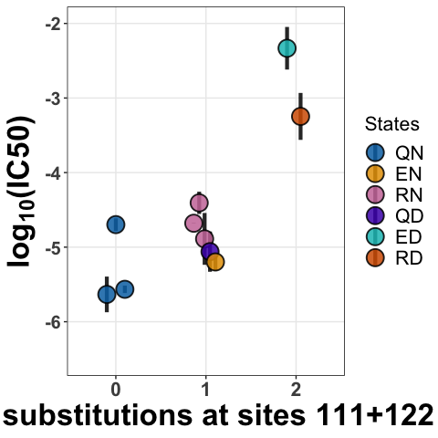
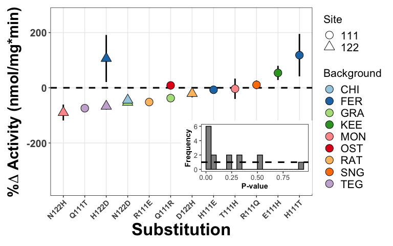
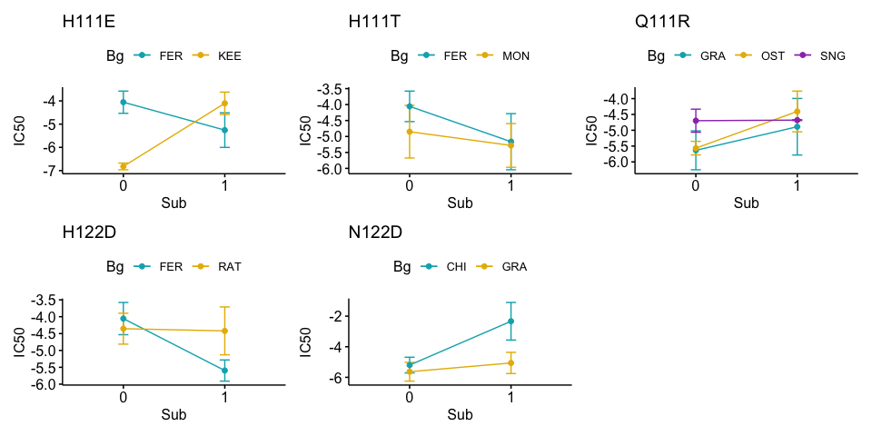
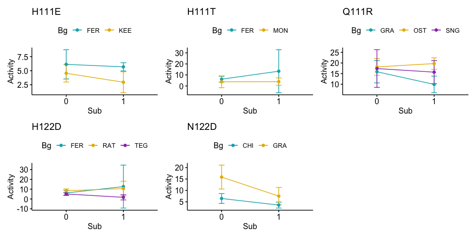

Mutation effects
================
Santiago Herrera
2023-04-22

This notebook contains the code for all panels in fig 4.

Panel B
-------

``` r
data <- read.csv("../data/mut_effects/IC50_and_ATPase_Data.csv",h=TRUE)
data <- data[data$native=="YES",]

construct <- unique(data$construct)
meanIC50 <- c()
sd <- c()
se <- c()
ci95 <- c()
mutation <- c()

for(i in 1:length(construct)){
  t <- data[data$construct==construct[i],]
  meanIC50 <- c(meanIC50,mean(t$IC50))
  sd <- c(sd,(sd(t$IC50)))
  se_i <- sd(t$IC50)/sqrt(length(t$IC50)) #standard error of the mean
  se <- c(se,se_i)
  ciMult <- qt(0.025, length(t$IC50)-1,lower.tail = FALSE) # critical value of t for small samples (t[a/2], with a = 0.05)
  ci95_i <- se_i * ciMult 
  ci95 <- c(ci95,ci95_i)
  mutation <- c(mutation,unique(t$mutations_111.122))
}
```

    ## Warning in qt(0.025, length(t$IC50) - 1, lower.tail = FALSE): NaNs produced

``` r
data_sum <- data.frame(construct,meanIC50,sd,se,ci95,mutation)
data_sum$state <- c("RD","EN","HH","EN","TN","QH","QN","RN","QN","RD","QN")
data_sum$state <- factor(data_sum$state, levels=c("QN","EN","RN","TN","QH","HH","RD"))

#Plot
ggplot(data_sum,aes(x=factor(mutation),y=meanIC50),color=state) +
  #geom_point(size=4,aes(fill = state),shape=21,position = "jitter") + 
  #geom_jitter(shape=21, size=4,aes(fill = state),width = 0.15) +
  geom_pointrange(aes(ymin=meanIC50-se, ymax=meanIC50+se,fill=state), size=1.5,shape=21,alpha=0.85,
                  position=position_dodge2(width=0.5)) +
  scale_fill_manual(values = c("#0072B2","#E69F00","#CC79A7","#000000","#009E73","#56B4E9","#D55E00")) +
  labs(x = "# substitutions at sites 111+122", y = expression(bold(paste("log"["10"],"(IC50)"))),fill="States") +
  theme(
    panel.background = element_rect(fill = NA),
    panel.border = element_rect(linetype = 1, fill = NA),
    panel.grid.major = element_line(colour = "grey92"),
    axis.text.x = element_text(face="bold", size=16),
    axis.text.y = element_text(face="bold", size=15), 
    axis.title = element_text(face="bold", size=25)
  ) +
  scale_y_continuous(limits = c(-6.5,-2.5)) +
  theme(legend.box.background = element_blank(),
        legend.key = element_rect(fill = "white"),
        legend.text = element_text(size=16),
        legend.title = element_text(size=16)) #+
```

    ## Warning: Removed 1 rows containing missing values (geom_segment).


``` r
  #geom_text_repel(data=data_sum,aes(label=construct), color = 'grey40', box.padding = unit(0.35, "lines"), 
  #                point.padding = unit(0.5, "lines"),force=1,direction="both",size=6)
```

Panel C
-------

``` r
data <- read.csv("../data/mut_effects/IC50_and_ATPase_Data.csv",h=TRUE)

prots <- c("Sandgrouse","Sandgruse+R111Q","Leptodactylus_S",
           "Leptodactylus_S +N122D","Leptodactylus_S +Q111R",
           "Chinchilla","Chinchilla+N122D","Ostrich","Ostrich+Q111R",
           "Leptodatylus_R")
data <- data[data$construct %in% prots,]

construct <- unique(data$construct)
meanIC50 <- c()
sd <- c()
se <- c()
ci95 <- c()
mutation <- c()

for(i in 1:length(construct)){
  t <- data[data$construct==construct[i],]
  meanIC50 <- c(meanIC50,mean(t$IC50))
  sd <- c(sd,(sd(t$IC50)))
  se_i <- sd(t$IC50)/sqrt(length(t$IC50)) #standard error of the mean
  se <- c(se,se_i)
  ciMult <- qt(0.025, length(t$IC50)-1,lower.tail = FALSE) # critical value of t for small samples (t[a/2], with a = 0.05)
  ci95_i <- se_i * ciMult 
  ci95 <- c(ci95,ci95_i)
  mutation <- c(mutation,unique(t$mutations_111.122))
}

data_sum <- data.frame(construct,meanIC50,sd,se,ci95,mutation) %>% tidyr::drop_na(meanIC50)
data_sum$state <- c("EN","QN","RN","ED","RN","QN","QN","RN","QD","RD")
data_sum$state <- factor(data_sum$state, levels=c("QN","EN","RN","QD","ED","RD"))
data_sum$sp <- c("Chinchilla","Ostrich","Sandgrouse","Chinchilla","Ostrich","Sandgrouse","Leptodactylus","Leptodactylus",
             "Leptodactylus","Leptodactylus")

data_sum$new_x <- c(1.17,0.15,0.8,1.85,0.85,0,-0.15,0.85,0.9,2.1)

native_prots <- data_sum[c(1,2,3,7),]

#Plot
ggplot(data_sum,aes(x=new_x,y=meanIC50),color=state) +
    geom_pointrange(aes(ymin=meanIC50-se, ymax=meanIC50+se,fill=state), size=1.5,shape=21,alpha=0.85,
                    position=position_dodge2(width=0.3)) +
    scale_fill_manual(values = c("#0072B2","#E69F00","#CC79A7","#4c04b8","#0fbfbf","#D55E00")) +
    scale_x_continuous(limits = c(-0.4,2.4),breaks = c(0,1,2),labels = c("0","1","2")) +
    labs(x = "# substitutions at sites 111+122", y = expression(bold(paste("log"["10"],"(IC50)"))),fill="States") +
    theme(
      panel.background = element_rect(fill = NA),
      panel.border = element_rect(linetype = 1, fill = NA),
      panel.grid.major = element_line(colour = "grey92"),
      axis.text.x = element_text(face="bold", size=16),
      axis.text.y = element_text(face="bold", size=15), 
      axis.title = element_text(face="bold", size=25)
    ) +
    scale_y_continuous(limits = c(-6.5,-2)) +
    theme(legend.box.background = element_blank(),
          legend.key = element_rect(fill = "white"),
          legend.text = element_text(size=16),
          legend.title = element_text(size=16)) #+
```



``` r
  #geom_text_repel(data=data_sum,aes(label=construct), color = 'grey40', box.padding = unit(0.35, "lines"), 
  #                point.padding = unit(0.5, "lines"),force=1,direction="both",size=3)
```

Panel D
-------

``` r
data <- read.csv("../data/mut_effects/Five_cases_mutations.csv",h=TRUE)

construct <- unique(data$construct)
construct <- construct[!construct %in% c("f1_Xenodon","f2_Xenodon","Lepto_S2")] # remove "duplicated" wild types
meanIC50 <- c()
sd <- c() #standard deviation
se <- c()
ci95 <- c() #95% confidence interval
mutation <- c()
bg <- c()

is.integer0 <- function(x)
{
  is.integer(x) && length(x) == 0L
}

for(i in 1:length(construct)){
  t <- data[data$construct==construct[i],]
  meanIC50 <- c(meanIC50,mean(t$IC50))
  sd_i <- sd(t$IC50)
  sd <- c(sd,sd_i)
  se_i <- sd(t$IC50)/sqrt(length(t$IC50))
  se <- c(se,se_i)
  ciMult <- 1.960*(sd_i/sqrt(dim(t)[1])) #Z value for 95% confidence interval
  ci95_i <- sd_i * ciMult 
  ci95 <- c(ci95,ci95_i)
  mutation <- c(mutation,unique(t$State))
  if(is.integer0(grep("\\+[A-Z][0-9]+[A-Z]",unique(t$construct)))) bg <- c(bg,"wt")
  else bg <- c(bg,"mutant")
}

data_sum <- data.frame(construct,meanIC50,sd,se,ci95,mutation,bg)
data_sum <- data_sum[!(grepl("Tupinambis",data_sum$construct)),]
data_sum$bg <- factor(x = data_sum$bg, levels = c("wt","mutant"))
data_sum$new_x <- c(1.4,3.5,1.6,3.5,3.4,1.6,3.5,3.5,1.4,3.4,1.4,3.6,1.6,3.6,1.6,3.4,3.6,1.4,3.5)

#Plot
ggplot(data_sum,aes(x=new_x,y=meanIC50)) + 
  geom_pointrange(aes(ymin=meanIC50-se, ymax=meanIC50+se,fill=mutation), size=1.5,shape=21,alpha=0.85,
                  position=position_dodge2(width=0.45)) +
  scale_fill_manual(values = c("#E69F00","#56B4E9","#009E73","#0072B2", "#D55E00")) +
  scale_x_continuous(limits = c(0.5,4.5),breaks = c(1.5,2.5,3.5),labels = c("wt","","mutant")) +
  labs(x = "Background", y = expression(bold(paste("log"["10"],"(IC50)"))),fill="Mutation") +
  theme(
    panel.background = element_rect(fill = NA),
    panel.border = element_rect(linetype = 1, fill = NA),
    panel.grid.major = element_line(colour = "grey92"),
    axis.text.x = element_text(face="bold", size=21),
    axis.text.y = element_text(face="bold", size=15), 
    axis.title = element_text(face="bold", size=25)
  ) +
  theme(legend.box.background = element_blank(),
        legend.key = element_rect(fill = "white"),
        legend.text = element_text(size=16),
        legend.title = element_text(size=16))
```


Panel E
-------

``` r
data <- read.csv("../data/mut_effects/Five_cases_mutations.csv",h=TRUE)

construct <- unique(data$construct)
construct <- construct[!construct %in% c("f1_Xenodon","f2_Xenodon","Lepto_S2")] # remove "duplicated" wild types
meanActivity <- c()
sd <- c() #standard deviation
se <- c()
ci95 <- c() #95% confidence interval
mutation <- c()
bg <- c()

is.integer0 <- function(x)
{
  is.integer(x) && length(x) == 0L
}

for(i in 1:length(construct)){
  t <- data[data$construct==construct[i],]
  meanActivity <- c(meanActivity,mean(t$Activity))
  sd_i <- sd(t$Activity)
  sd <- c(sd,sd_i)
  se_i <- sd(t$Activity)/sqrt(length(t$Activity))
  se <- c(se,se_i)
  ciMult <- 1.960*(sd_i/sqrt(dim(t)[1])) #Z value for 95% confidence interval
  ci95_i <- sd_i * ciMult 
  ci95 <- c(ci95,ci95_i)
  mutation <- c(mutation,unique(t$State))
  if(is.integer0(grep("\\+[A-Z][0-9]+[A-Z]",unique(t$construct)))) bg <- c(bg,"wt")
  else bg <- c(bg,"mutant")
}

data_sum <- data.frame(construct,meanActivity,sd,se,ci95,mutation,bg)
data_sum$bg <- factor(x = data_sum$bg, levels = c("wt","mutant"))
data_sum$new_x <- c(1.4,3.6,1.5,3.5,3.4,1.5,3.4,3.5,1.5,3.5,1.5,3.4,1.5,3.5,1.4,3.6,1.6,3.6,3.5,1.6,3.6)

#Plot
ggplot(data_sum,aes(x=new_x,y=meanActivity)) + 
  geom_pointrange(aes(ymin=meanActivity-se, ymax=meanActivity+se,fill=mutation), size=1.5,shape=21,alpha=0.85,
                  position=position_dodge2(width=0.3)) +
  scale_fill_manual(values = c("#E69F00","#56B4E9","#009E73","#0072B2", "#D55E00")) +
  scale_x_continuous(limits = c(0.5,4.5),breaks = c(1.5,2.5,3.5),labels = c("wt","","mutant")) +
  labs(x = "Background", y = "Activity (nmol/mg*min)",fill="Mutation") +
  theme(
    panel.background = element_rect(fill = NA),
    panel.border = element_rect(linetype = 1, fill = NA),
    panel.grid.major = element_line(colour = "grey92"),
    axis.text.x = element_text(face="bold", size=21),
    axis.text.y = element_text(face="bold", size=15), 
    axis.title = element_text(face="bold", size=25)
  ) +
  theme(legend.box.background = element_blank(),
        legend.key = element_rect(fill = "white"),
        legend.text = element_text(size=16),
        legend.title = element_text(size=16))
```


Panel F
-------

``` r
data <- read.csv("../data/mut_effects/percent_activity_changes.csv",h=T)

#Standard error of the percent change of means
#https://stats.stackexchange.com/questions/376639/what-is-the-standard-error-of-the-difference-in-means-scaled-as-percent-differen
#https://www2.census.gov/programs-surveys/acs/tech_docs/accuracy/percchg.pdf
se_perc_change <- function(d1,d2){
  # d1 and d2 are the trplicate measurements of each construct
  m1 <- mean(d1)
  m2 <- mean(d2)
  se1 <- sd(d1)/sqrt(length(d1))
  se2 <- sd(d2)/sqrt(length(d2))
  
  a <- abs(m2/m1)
  b <- (se1^2)/(m1^2)
  c <- (se2^2)/(m2^2)
  
  print(paste("mean dif: ",m2-m1,"\n","%change: ",((m2-m1)/m1)*100))
  return(a*sqrt(b+c)*100)
}


p1 <- data %>%
  #arrange(recalc_.change) %>% # First sort by val. This sorts the dataframe but NOT the factor levels
  mutate(subs=factor(subs, levels=unique(subs))) %>%   # Update the factor levels
  ggplot(aes(x=subs,y=recalc_.change)) +
  geom_hline(yintercept=0, linetype="dashed", color="black", size=1.1) +
  geom_errorbar(aes(ymin = recalc_.change-SE_.change, ymax = recalc_.change+SE_.change),width = 0,color="black",size=1) +
  geom_point(aes(shape=factor(site),fill=Bg2),size=5) +
  scale_y_continuous(limits=c(-360,260)) +
  scale_fill_brewer(palette = "Paired") +
  scale_shape_manual(values = c(21,24)) +
  labs(x = "Substitution", y = expression(bold(paste("%",Delta, " Activity (nmol/mg*min)"))),shape="Site",fill="Background") +
  theme(
    panel.background = element_rect(fill = NA),
    panel.border = element_rect(linetype = 1, fill = NA),
    panel.grid.major = element_line(colour = "grey92"),
    axis.text.x = element_text(face="bold", size=11,angle = 45,hjust = 1),
    axis.text.y = element_text(face="bold", size=15), 
    axis.title.x = element_text(face="bold", size=25),
    axis.title.y = element_text(face="bold", size=22)
  ) +
  theme(legend.box.background = element_blank(),
        legend.key = element_rect(fill = "white"),
        legend.text = element_text(size=16),
        legend.title = element_text(size=16)) +
  guides(fill = guide_legend(override.aes=list(shape=21)))

brks <- hist(data$t.testp, breaks=15, plot=F)$breaks
p2 <- ggplot(data,aes(x=t.testp)) + 
  geom_histogram(binwidth=0.05,color="black", fill="gray56",stat="bin",breaks=brks) +
  labs(x = "P-value", y = "Frequency") +
  theme(
    panel.background = element_rect(fill = NA),
    panel.border = element_rect(linetype = 1, fill = NA),
    panel.grid.major = element_line(colour = "white"),
    axis.text.x = element_text(size=10),
    axis.text.y = element_text(size=10), 
    axis.title = element_text(face="bold", size=11)
  ) +
  geom_hline(yintercept=1, linetype="dashed", color="black", size=1.1)
 
p1 + inset_element(p2, left=0.4, bottom=0, right=1, top=0.5)
```



Visually check the ANOVAs
-------------------------

Check visually the results of the two-way ANOVAs for panels D and E

``` r
rev <- read.csv("../data/mut_effects/Reversibility.csv",h=T)
eq <- read.csv("../data/mut_effects/Equivalence.csv",h=T)

#H111E
h111e <- rev[rev$State=="H111E",]
h111e$Background <- as.factor(h111e$Background)
h111e$Sub <- as.factor(h111e$Sub)
h111e$Bg <- rep(c("FER","KEE"),each=6)

summary(aov(IC50 ~ Background * Sub, data = h111e))
```

    ##                Df Sum Sq Mean Sq F value   Pr(>F)    
    ## Background      1  1.948   1.948   46.34 0.000137 ***
    ## Sub             1  1.723   1.723   40.99 0.000209 ***
    ## Background:Sub  1 11.521  11.521  274.14 1.79e-07 ***
    ## Residuals       8  0.336   0.042                     
    ## ---
    ## Signif. codes:  0 '***' 0.001 '**' 0.01 '*' 0.05 '.' 0.1 ' ' 1

``` r
a <- ggline(h111e, x = "Sub", y = "IC50", color = "Bg",
       add = c("mean_ci",  error.plot = "pointrange"),
       palette = c("#00AFBB", "#E7B800"),title="H111E")

a1 <- ggline(h111e, x = "Sub", y = "Activity", color = "Bg",
            add = c("mean_ci",  error.plot = "pointrange"),
            palette = c("#00AFBB", "#E7B800"),title="H111E")

#H111T
h111t <- rev[rev$State=="H111T",]
h111t$Background <- as.factor(h111t$Background)
h111t$Sub <- as.factor(h111t$Sub)
h111t$Bg <- rep(c("FER","MON"),each=6)

summary(aov(IC50 ~ Background * Sub, data = h111t))
```

    ##                Df Sum Sq Mean Sq F value  Pr(>F)   
    ## Background      1 0.6233  0.6233   7.147 0.02821 * 
    ## Sub             1 1.7743  1.7743  20.344 0.00197 **
    ## Background:Sub  1 0.3449  0.3449   3.954 0.08197 . 
    ## Residuals       8 0.6977  0.0872                   
    ## ---
    ## Signif. codes:  0 '***' 0.001 '**' 0.01 '*' 0.05 '.' 0.1 ' ' 1

``` r
b <- ggline(h111t, x = "Sub", y = "IC50", color = "Bg",
       add = c("mean_ci",  error.plot = "pointrange"),
       palette = c("#00AFBB", "#E7B800"),title="H111T")

b1 <- ggline(h111t, x = "Sub", y = "Activity", color = "Bg",
            add = c("mean_ci",  error.plot = "pointrange"),
            palette = c("#00AFBB", "#E7B800"),title="H111T")


#Q111R
q111r <- rev[rev$State=="Q111R",]
q111r$Background <- as.factor(q111r$Background)
q111r$Sub <- as.factor(q111r$Sub)
q111r$Bg <- rep(c("OST","GRA","SNG"),times=c(6,12,6))

anova(aov(IC50 ~ Background * Sub, data = q111r))
```

    ## Analysis of Variance Table
    ## 
    ## Response: IC50
    ##                Df Sum Sq Mean Sq F value   Pr(>F)   
    ## Background      2 1.3457 0.67287  2.1902 0.140818   
    ## Sub             1 2.6663 2.66625  8.6784 0.008643 **
    ## Background:Sub  2 1.0133 0.50666  1.6492 0.219962   
    ## Residuals      18 5.5301 0.30723                    
    ## ---
    ## Signif. codes:  0 '***' 0.001 '**' 0.01 '*' 0.05 '.' 0.1 ' ' 1

``` r
c <- ggline(q111r, x = "Sub", y = "IC50", color = "Bg",
       add = c("mean_ci",  error.plot = "pointrange"),
       palette = c("#00AFBB", "#E7B800","#9d3dba"),title="Q111R")

c1 <- ggline(q111r, x = "Sub", y = "Activity", color = "Bg",
            add = c("mean_ci",  error.plot = "pointrange"),
            palette = c("#00AFBB", "#E7B800","#9d3dba"),title="Q111R")

#H122D
h122d <- rev[rev$State=="H122D",]
h122d$Background <- as.factor(h122d$Background)
h122d$Sub <- as.factor(h122d$Sub)
h122d$Bg <- rep(c("FER","TEG","RAT"),each=6)

summary(aov(IC50 ~ Background * Sub, data = h122d[!(grepl("Tupinambis",h122d$construct)),]))
```

    ##                Df Sum Sq Mean Sq F value   Pr(>F)    
    ## Background      1 0.5759  0.5759   13.66 0.006082 ** 
    ## Sub             1 1.9342  1.9342   45.87 0.000142 ***
    ## Background:Sub  1 1.6322  1.6322   38.71 0.000253 ***
    ## Residuals       8 0.3373  0.0422                     
    ## ---
    ## Signif. codes:  0 '***' 0.001 '**' 0.01 '*' 0.05 '.' 0.1 ' ' 1

``` r
d <- h122d %>% slice(-c(7:12)) %>%
  ggline(., x = "Sub", y = "IC50", color = "Bg",
       add = c("mean_ci",  error.plot = "pointrange"),
       palette = c("#00AFBB", "#E7B800"),title="H122D")

d1 <- ggline(h122d, x = "Sub", y = "Activity", color = "Bg",
         add = c("mean_ci",  error.plot = "pointrange"),
         palette = c("#00AFBB", "#E7B800","#9d3dba"),title="H122D")

#N122D
n122d <- eq[eq$State=="N122D",]
n122d$Background <- as.factor(n122d$Background)
n122d$Sub <- as.factor(n122d$Sub)
n122d$Bg <- rep(c("GRA","CHI"),times=c(12,6))

summary(aov(IC50 ~ Background * Sub, data = n122d))
```

    ##                Df Sum Sq Mean Sq F value   Pr(>F)    
    ## Background      1 10.003  10.003   31.30 6.61e-05 ***
    ## Sub             1  8.052   8.052   25.20 0.000188 ***
    ## Background:Sub  1  5.253   5.253   16.44 0.001183 ** 
    ## Residuals      14  4.474   0.320                     
    ## ---
    ## Signif. codes:  0 '***' 0.001 '**' 0.01 '*' 0.05 '.' 0.1 ' ' 1

``` r
e <- ggline(n122d, x = "Sub", y = "IC50", color = "Bg",
       add = c("mean_ci",  error.plot = "pointrange"),
       palette = c("#00AFBB", "#E7B800"),title="N122D")

e1 <- ggline(n122d, x = "Sub", y = "Activity", color = "Bg",
            add = c("mean_ci",  error.plot = "pointrange"),
            palette = c("#00AFBB", "#E7B800"),title="N122D")


# PLOT
a+b+c+d+e
```



``` r
a1+b1+c1+d1+e1
```


