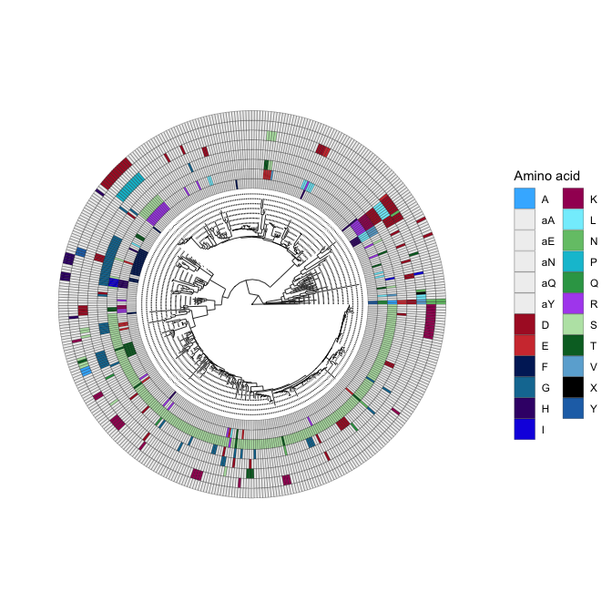
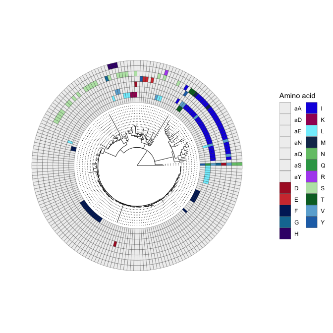
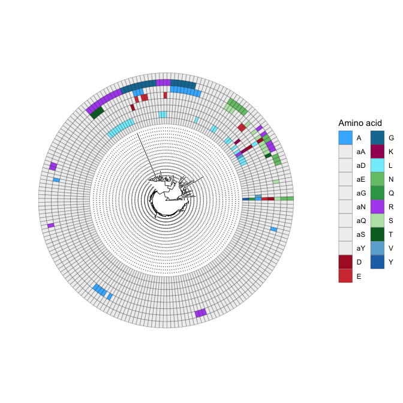

Phylogenies and ASR
================
Santiago Herrera
2023-04-22

Import data
===========

``` r
# import ASR of H1-H2 extracellular loop
aa_data <- read.csv("../data/Vertebrate_ATP1A1-3_AA_alignment_extraction_108-M1-M2_region_codeml_aln.csv",row.names=1,h=FALSE) %>%
  .[,-c(2,3,8)]
aa_data <- as.matrix(aa_data)[,1:13]
colnames(aa_data)<-c("108","111","112","113","114","115","116","117","118","119","120","121","122")

# import ATPa gene family phylogeny
tree <- ape::read.nexus("../data/A1-A3_AA_alignment_convergence_modified.phy_phyml_tree.tre")
tree$tip.label <- gsub("'","",tree$tip.label) %>%
  gsub("(lungfish|fish|caecilian|frog|lizard|snake|bird|crocodilian|mammal|turtle)(.*)(_A1|_A2|_A3)(.*)","\\1\\2\\3",.)

# Check that species names in alignment and tip labels match; fix manually the ones not matching
tree$tip.label[!(tree$tip.label %in% row.names(aa_data))] #spp in tree not in aln (mismatch)
```

    ## [1] "snake|Thamnophis_sirtalis_A1_XM014070061_A1"          
    ## [2] "mammal|Neophocaena_asiaeorientalis_asiaeorientalis_A3"
    ## [3] "fish|Latimeria_chalumnae_A2"                          
    ## [4] "mammal|Neophocaena_asiaeorientalis_asiaeorientalis_A2"

``` r
tree$tip.label <- gsub("Thamnophis_sirtalis_A1_XM014070061_A1","Thamnophis_sirtalis_A1",tree$tip.label)
tree$tip.label <- gsub("Neophocaena_asiaeorientalis_asiaeorientalis_A3","Neophocaena_asiaeorientalis_A3",tree$tip.label)
tree$tip.label <- gsub("Neophocaena_asiaeorientalis_asiaeorientalis_A2","Neophocaena_asiaeorientalis_A2",tree$tip.label)
tree <- drop.tip(tree,name.check(tree,aa_data)$tree_not_data)  

# Extract subtrees
a1_tips <- tree$tip.label[grepl("_A1",tree$tip.label)]
ATP1A1_subtree <- keep.tip(tree,a1_tips)
  
a2_tips <- tree$tip.label[grepl("_A2",tree$tip.label)]
ATP1A2_subtree <- keep.tip(tree,a2_tips)

a3_tips <- tree$tip.label[grepl("_A3",tree$tip.label)]
ATP1A3_subtree <- keep.tip(tree,a3_tips)

# Extract subalignments and make sure they match tip labels
match_a1 <- row.names(aa_data) %in% ATP1A1_subtree$tip.label
aa_data_a1 <- as.data.frame(aa_data[match_a1,])
aa_data_a1 <- as.data.frame(aa_data_a1)
#ATP1A1_subtree <- drop.tip(ATP1A1_subtree,name.check(ATP1A1_subtree,aa_data_a1)$tree_not_data) 
print(paste("Alignment and tree match: ", name.check(ATP1A1_subtree,aa_data_a1)))
```

    ## [1] "Alignment and tree match:  OK"

``` r
match_a2 <- row.names(aa_data) %in% ATP1A2_subtree$tip.label
aa_data_a2 <- as.data.frame(aa_data[match_a2,])
aa_data_a2 <- as.data.frame(aa_data_a2)
#ATP1A2_subtree <- drop.tip(ATP1A2_subtree,name.check(ATP1A2_subtree,aa_data_a2)$tree_not_data)
print(paste("Alignment and tree match: ", name.check(ATP1A2_subtree,aa_data_a2)))
```

    ## [1] "Alignment and tree match:  OK"

``` r
match_a3 <- row.names(aa_data) %in% ATP1A3_subtree$tip.label
aa_data_a3 <- as.data.frame(aa_data[match_a3,])
aa_data_a3 <- as.data.frame(aa_data_a3)
#ATP1A3_subtree <- drop.tip(ATP1A3_subtree,name.check(ATP1A3_subtree,aa_data_a3)$tree_not_data)
print(paste("Alignment and tree match: ", name.check(ATP1A3_subtree,aa_data_a3)))
```

    ## [1] "Alignment and tree match:  OK"

ATP1A1 subtree
--------------

``` r
#Extract tetrapod clades
mask <- grep(pattern = "frog|caecilian|mammal|bird|lizard|snake|turtle|crocodilian",x=rownames(aa_data_a1),ignore.case = TRUE)

#Ancestral states site 108: Y 
anc108 <- aa_data_a1[mask,] %>% gsub(pattern = "Y",replacement = "aY",x = .$`108`) #Change state to ancestral 'aX'
aa_data_a1$`108` <- as.character(aa_data_a1$`108`)
aa_data_a1[mask,]$`108` <- anc108 #Replace cases where a taxon has ancestral state
aa_data_a1$`108` <- as.factor(aa_data_a1$`108`)

#Ancestral states site 111: Q
anc111 <- aa_data_a1[mask,] %>% gsub(pattern = "Q",replacement = "aQ",x = .$`111`)
aa_data_a1$`111` <- as.character(aa_data_a1$`111`)
aa_data_a1[mask,]$`111` <- anc111
aa_data_a1$`111` <- as.factor(aa_data_a1$`111`)

#Ancestral states site 112: A 
anc112 <- aa_data_a1[mask,] %>% gsub(pattern = "A",replacement = "aA",x = .$`112`)
aa_data_a1$`112` <- as.character(aa_data_a1$`112`)
aa_data_a1[mask,]$`112` <- anc112
aa_data_a1$`112` <- as.factor(aa_data_a1$`112`)

#Ancestral states site 113: A
anc113 <- aa_data_a1[mask,] %>% gsub(pattern = "A",replacement = "aA",x = .$`113`)
aa_data_a1$`113` <- as.character(aa_data_a1$`113`)
aa_data_a1[mask,]$`113` <- anc113
aa_data_a1$`113` <- as.factor(aa_data_a1$`113`)

#Ancestral states site 114: T
anc114 <- aa_data_a1[mask,] %>% gsub(pattern = "T",replacement = "aT",x = .$`114`)
aa_data_a1$`114` <- as.character(aa_data_a1$`114`)
aa_data_a1[mask,]$`114` <- anc114
aa_data_a1$`114` <- as.factor(aa_data_a1$`114`)

#Ancestral states site 115: E 
anc115 <- aa_data_a1[mask,] %>% gsub(pattern = "E",replacement = "aE",x = .$`115`)
aa_data_a1$`115` <- as.character(aa_data_a1$`115`)
aa_data_a1[mask,]$`115` <- anc115
aa_data_a1$`115` <- as.factor(aa_data_a1$`115`)

#Ancestral states site 116: E
anc116 <- aa_data_a1[mask,] %>% gsub(pattern = "E",replacement = "aE",x = .$`116`)
aa_data_a1$`116` <- as.character(aa_data_a1$`116`)
aa_data_a1[mask,]$`116` <- anc116
aa_data_a1$`116` <- as.factor(aa_data_a1$`116`)

#Ancestral states site 117: E
anc117 <- aa_data_a1[mask,] %>% gsub(pattern = "E",replacement = "aE",x = .$`117`)
aa_data_a1$`117` <- as.character(aa_data_a1$`117`)
aa_data_a1[mask,]$`117` <- anc117
aa_data_a1$`117` <- as.factor(aa_data_a1$`117`)

#Ancestral states site 118: P
anc118 <- aa_data_a1[mask,] %>% gsub(pattern = "P",replacement = "aP",x = .$`118`)
aa_data_a1$`118` <- as.character(aa_data_a1$`118`)
aa_data_a1[mask,]$`118` <- anc118
aa_data_a1$`118` <- as.factor(aa_data_a1$`118`)

#Ancestral states site 119: Q (amph, mammal) and N (reptile)
maskQ <- grep(pattern = "frog|caecelian|caecilian|mammal",x=rownames(aa_data_a1),ignore.case = TRUE)
anc119a <- aa_data_a1[maskQ,] %>% gsub(pattern = "Q",replacement = "aQ",x = .$`119`)
aa_data_a1$`119` <- as.character(aa_data_a1$`119`)
aa_data_a1[maskQ,]$`119` <- anc119a

maskN <- grep(pattern = "bird|lizard|snake|turtle|croc",x=rownames(aa_data_a1),ignore.case = TRUE)
anc119b <- aa_data_a1[maskN,] %>% gsub(pattern = "N",replacement = "aN",x = .$`119`)
aa_data_a1[maskN,]$`119` <- anc119b

aa_data_a1$`119` <- as.factor(aa_data_a1$`119`)

#Ancestral states site 120: N
anc120 <- aa_data_a1[mask,] %>% gsub(pattern = "N",replacement = "aN",x = .$`120`)
aa_data_a1$`120` <- as.character(aa_data_a1$`120`)
aa_data_a1[mask,]$`120` <- anc120
aa_data_a1$`120` <- as.factor(aa_data_a1$`120`)

#Ancestral states site 121: D
anc121 <- aa_data_a1[mask,] %>% gsub(pattern = "D",replacement = "aD",x = .$`121`)
aa_data_a1$`121` <- as.character(aa_data_a1$`121`)
aa_data_a1[mask,]$`121` <- anc121
aa_data_a1$`121` <- as.factor(aa_data_a1$`121`)

#Ancestral states site 122: N
anc122 <- aa_data_a1[mask,] %>% gsub(pattern = "N",replacement = "aN",x = .$`122`)
aa_data_a1$`122` <- as.character(aa_data_a1$`122`)
aa_data_a1[mask,]$`122` <- anc122
aa_data_a1$`122` <- as.factor(aa_data_a1$`122`)

##Only using sites 108,111,112,115,116,119,120,122 (and anc. states of amph, mammal, reptile)
aa_data_a1 <- dplyr::select(aa_data_a1,`108`,`111`,`112`,`115`,`116`,`119`,`120`,`122`)

p <- ggtree(ATP1A1_subtree,layout='circular',size=0.3) + 
  geom_tiplab(size=0, align=TRUE, linesize=.3) #Circular phylogeny
```

    ## Warning: Duplicated aesthetics after name standardisation: size

    ## Warning: Duplicated aesthetics after name standardisation: size

``` r
col <- c(rep("#F0F0F0",5), #Anc AA states
         "#40b7ff", #A, hydrophobic
         "#1279a1", #G, hydrophobic
         "#1906e1", #I, hydrophobic
         "#00c1d5", #P, hydrophobic
         "#002366", #F, hydrophobic #F0F0F0
         "#82eefd", #L, hydrophobic #BDD7E7
         "#6BAED6", #V, hydrophobic
         "#2171B5", #Y, hydrophobic
         "#BAE4B3", #S, polar
         "#74C476", #N, polar
         "#31A354", #Q, polar
         "#006D2C", #T, polar
         "#ad1d2d", #D, acidic
         "#d23c3d", #E, acidic
         "#3e0a77", #H, basic
         "#a30262", #K, basic
         "#b056ef", #R, basic
         "#000000" #X, missing data
)
names(col) <- c("aA","aE","aN","aQ","aY",
                "A","G","I","P","F","L","V","Y",
                "S","N","Q","T",
                "D","E",
                "H","K","R",
                "X")

gheatmap(p, aa_data_a1, offset=0.0001, width=0.7, 
         colnames=FALSE, legend_title="Amino acid",color = "black") + 
  scale_fill_manual(values=col, name="Amino acid")
```

    ## Warning: attributes are not identical across measure variables;
    ## they will be dropped

    ## Scale for 'y' is already present. Adding another scale for 'y', which will
    ## replace the existing scale.

    ## Scale for 'fill' is already present. Adding another scale for 'fill', which
    ## will replace the existing scale.



ATP1A2 subtree
--------------

``` r
#Extract tetrapod clades
mask <- grep(pattern = "frog|caecilian|mammal|bird|lizard|snake|turtle|crocodilian",x=rownames(aa_data_a2),ignore.case = TRUE)

#Ancestral states site 108: Y 
anc108 <- aa_data_a2[mask,] %>% gsub(pattern = "Y",replacement = "aY",x = .$`108`)
aa_data_a2$`108` <- as.character(aa_data_a2$`108`)
aa_data_a2[mask,]$`108` <- anc108
aa_data_a2$`108` <- as.factor(aa_data_a2$`108`)

#Ancestral states site 111: Q
anc111 <- aa_data_a2[mask,] %>% gsub(pattern = "Q",replacement = "aQ",x = .$`111`)
aa_data_a2$`111` <- as.character(aa_data_a2$`111`)
aa_data_a2[mask,]$`111` <- anc111
aa_data_a2$`111` <- as.factor(aa_data_a2$`111`)

#Ancestral states site 112: A 
anc112 <- aa_data_a2[mask,] %>% gsub(pattern = "A",replacement = "aA",x = .$`112`)
aa_data_a2$`112` <- as.character(aa_data_a2$`112`)
aa_data_a2[mask,]$`112` <- anc112
aa_data_a2$`112` <- as.factor(aa_data_a2$`112`)

#Ancestral states site 113: A
anc113 <- aa_data_a2[mask,] %>% gsub(pattern = "A",replacement = "aA",x = .$`113`)
aa_data_a2$`113` <- as.character(aa_data_a2$`113`)
aa_data_a2[mask,]$`113` <- anc113
aa_data_a2$`113` <- as.factor(aa_data_a2$`113`)

#Ancestral states site 114: M
anc114 <- aa_data_a2[mask,] %>% gsub(pattern = "M",replacement = "aM",x = .$`114`)
aa_data_a2$`114` <- as.character(aa_data_a2$`114`)
aa_data_a2[mask,]$`114` <- anc114
aa_data_a2$`114` <- as.factor(aa_data_a2$`114`)

#Ancestral states site 115: E 
anc115 <- aa_data_a2[mask,] %>% gsub(pattern = "E",replacement = "aE",x = .$`115`)
aa_data_a2$`115` <- as.character(aa_data_a2$`115`)
aa_data_a2[mask,]$`115` <- anc115
aa_data_a2$`115` <- as.factor(aa_data_a2$`115`)

#Ancestral states site 116: D
anc116 <- aa_data_a2[mask,] %>% gsub(pattern = "D",replacement = "aD",x = .$`116`)
aa_data_a2$`116` <- as.character(aa_data_a2$`116`)
aa_data_a2[mask,]$`116` <- anc116
aa_data_a2$`116` <- as.factor(aa_data_a2$`116`)

#Ancestral states site 117: E
anc117 <- aa_data_a2[mask,] %>% gsub(pattern = "E",replacement = "aE",x = .$`117`)
aa_data_a2$`117` <- as.character(aa_data_a2$`117`)
aa_data_a2[mask,]$`117` <- anc117
aa_data_a2$`117` <- as.factor(aa_data_a2$`117`)

#Ancestral states site 118: P
anc118 <- aa_data_a2[mask,] %>% gsub(pattern = "P",replacement = "aP",x = .$`118`)
aa_data_a2$`118` <- as.character(aa_data_a2$`118`)
aa_data_a2[mask,]$`118` <- anc118
aa_data_a2$`118` <- as.factor(aa_data_a2$`118`)

#Ancestral states site 119: A (amph, reptile) and S (mammal)
maskQ <- grep(pattern = "frog|caecelian|caecilian|bird|lizard|snake|turtle|tutle|crocodilian",x=rownames(aa_data_a2),ignore.case = TRUE)
anc119a <- aa_data_a2[maskQ,] %>% gsub(pattern = "A",replacement = "aA",x = .$`119`)
aa_data_a2$`119` <- as.character(aa_data_a2$`119`)
aa_data_a2[maskQ,]$`119` <- anc119a

maskN <- grep(pattern = "mammal",x=rownames(aa_data_a2),ignore.case = TRUE)
anc119b <- aa_data_a2[maskN,] %>% gsub(pattern = "S",replacement = "aS",x = .$`119`)
aa_data_a2[maskN,]$`119` <- anc119b

aa_data_a2$`119` <- as.factor(aa_data_a2$`119`)

#Ancestral states site 120: N
anc120 <- aa_data_a2[mask,] %>% gsub(pattern = "N",replacement = "aN",x = .$`120`)
aa_data_a2$`120` <- as.character(aa_data_a2$`120`)
aa_data_a2[mask,]$`120` <- anc120
aa_data_a2$`120` <- as.factor(aa_data_a2$`120`)

#Ancestral states site 121: D
anc121 <- aa_data_a2[mask,] %>% gsub(pattern = "D",replacement = "aD",x = .$`121`)
aa_data_a2$`121` <- as.character(aa_data_a2$`121`)
aa_data_a2[mask,]$`121` <- anc121
aa_data_a2$`121` <- as.factor(aa_data_a2$`121`)

#Ancestral states site 122: N
anc122 <- aa_data_a2[mask,] %>% gsub(pattern = "N",replacement = "aN",x = .$`122`)
aa_data_a2$`122` <- as.character(aa_data_a2$`122`)
aa_data_a2[mask,]$`122` <- anc122
aa_data_a2$`122` <- as.factor(aa_data_a2$`122`)

##Only using sites 108,111,112,115,116,119,120,122 (and anc. states of amph, mammal, reptile)

aa_data_a2 <- dplyr::select(aa_data_a2,`108`,`111`,`112`,`115`,`116`,`119`,`120`,`122`)

p <- ggtree(ATP1A2_subtree,layout='circular',size=0.3) + 
  geom_tiplab(size=0, align=TRUE, linesize=.3)
```

    ## Warning: Duplicated aesthetics after name standardisation: size

    ## Warning: Duplicated aesthetics after name standardisation: size

``` r
col <- c(rep("#F0F0F0",7), #Anc AA states
         "#40b7ff", #A, hydrophobic
         "#1279a1", #G, hydrophobic
         "#1906e1", #I, hydrophobic
         "#163459", #M, hydrophobic
         "#002366", #F, hydrophobic #F0F0F0
         "#82eefd", #L, hydrophobic #BDD7E7
         "#6BAED6", #V, hydrophobic
         "#2171B5", #Y, hydrophobic
         "#BAE4B3", #S, polar
         "#74C476", #N, polar
         "#31A354", #Q, polar
         "#006D2C", #T, polar
         "#ad1d2d", #D, acidic
         "#d23c3d", #E, acidic
         "#3e0a77", #H, basic
         "#a30262", #K, basic
         "#b056ef" #R, basic
)
names(col) <- c("aA","aD","aE","aN","aQ","aS","aY",
                "A","G","I","M","F","L","V","Y",
                "S","N","Q","T",
                "D","E",
                "H","K","R")

gheatmap(p, aa_data_a2, offset=0.0001, width=0.7, 
         colnames=FALSE, legend_title="Amino acid",color = "black") + 
  scale_fill_manual(values=col, name="Amino acid")
```

    ## Warning: attributes are not identical across measure variables;
    ## they will be dropped

    ## Scale for 'y' is already present. Adding another scale for 'y', which will
    ## replace the existing scale.

    ## Scale for 'fill' is already present. Adding another scale for 'fill', which
    ## will replace the existing scale.



ATP1A3 subtree
--------------

``` r
#Extract tetrapod clades
mask <- grep(pattern = "frog|caecilian|mammal|bird|lizard|snake|turtle|crocodilian",x=rownames(aa_data_a3),ignore.case = TRUE)

#Ancestral states site 108: Y 
anc108 <- aa_data_a3[mask,] %>% gsub(pattern = "Y",replacement = "aY",x = .$`108`)
aa_data_a3$`108` <- as.character(aa_data_a3$`108`)
aa_data_a3[mask,]$`108` <- anc108
aa_data_a3$`108` <- as.factor(aa_data_a3$`108`)

#Ancestral states site 111: Q
anc111 <- aa_data_a3[mask,] %>% gsub(pattern = "Q",replacement = "aQ",x = .$`111`)
aa_data_a3$`111` <- as.character(aa_data_a3$`111`)
aa_data_a3[mask,]$`111` <- anc111
aa_data_a3$`111` <- as.factor(aa_data_a3$`111`)

#Ancestral states site 112: A 
anc112 <- aa_data_a3[mask,] %>% gsub(pattern = "A",replacement = "aA",x = .$`112`)
aa_data_a3$`112` <- as.character(aa_data_a3$`112`)
aa_data_a3[mask,]$`112` <- anc112
aa_data_a3$`112` <- as.factor(aa_data_a3$`112`)

#Ancestral states site 113: G
anc113 <- aa_data_a3[mask,] %>% gsub(pattern = "G",replacement = "aG",x = .$`113`)
aa_data_a3$`113` <- as.character(aa_data_a3$`113`)
aa_data_a3[mask,]$`113` <- anc113
aa_data_a3$`113` <- as.factor(aa_data_a3$`113`)

#Ancestral states site 114: T (rep & mammal), M (amph)
maskT <- grep(pattern = "bird|lizard|snake|turtle|crocodilian|mammal",x=rownames(aa_data_a3),ignore.case = TRUE)
anc114a <- aa_data_a3[maskT,] %>% gsub(pattern = "T",replacement = "aT",x = .$`114`)
aa_data_a3$`114` <- as.character(aa_data_a3$`114`)
aa_data_a3[maskT,]$`114` <- anc114a

maskM <- grep(pattern = "frog|caecelian|caecilian|",x=rownames(aa_data_a3),ignore.case = TRUE)
anc114b <- aa_data_a3[maskM,] %>% gsub(pattern = "M",replacement = "aM",x = .$`114`)
aa_data_a3[maskM,]$`114` <- anc114b

aa_data_a3$`114` <- as.factor(aa_data_a3$`114`)

#Ancestral states site 115: E 
anc115 <- aa_data_a3[mask,] %>% gsub(pattern = "E",replacement = "aE",x = .$`115`)
aa_data_a3$`115` <- as.character(aa_data_a3$`115`)
aa_data_a3[mask,]$`115` <- anc115
aa_data_a3$`115` <- as.factor(aa_data_a3$`115`)

#Ancestral states site 116: D
anc116 <- aa_data_a3[mask,] %>% gsub(pattern = "D",replacement = "aD",x = .$`116`)
aa_data_a3$`116` <- as.character(aa_data_a3$`116`)
aa_data_a3[mask,]$`116` <- anc116
aa_data_a3$`116` <- as.factor(aa_data_a3$`116`)

#Ancestral states site 117: D
anc117 <- aa_data_a3[mask,] %>% gsub(pattern = "D",replacement = "aD",x = .$`117`)
aa_data_a3$`117` <- as.character(aa_data_a3$`117`)
aa_data_a3[mask,]$`117` <- anc117
aa_data_a3$`117` <- as.factor(aa_data_a3$`117`)

#Ancestral states site 118: P
anc118 <- aa_data_a3[mask,] %>% gsub(pattern = "P",replacement = "aP",x = .$`118`)
aa_data_a3$`118` <- as.character(aa_data_a3$`118`)
aa_data_a3[mask,]$`118` <- anc118
aa_data_a3$`118` <- as.factor(aa_data_a3$`118`)

#Ancestral states site 119: A (amph) and S (mammal,reptile)
maskQ <- grep(pattern = "frog|caecelian|caecilian",x=rownames(aa_data_a3),ignore.case = TRUE)
anc119a <- aa_data_a3[maskQ,] %>% gsub(pattern = "A",replacement = "aA",x = .$`119`)
aa_data_a3$`119` <- as.character(aa_data_a3$`119`)
aa_data_a3[maskQ,]$`119` <- anc119a

maskN <- grep(pattern = "mammal|bird|lizard|snake|turtle|tutle|crocodilian",x=rownames(aa_data_a3),ignore.case = TRUE)
anc119b <- aa_data_a3[maskN,] %>% gsub(pattern = "S",replacement = "aS",x = .$`119`)
aa_data_a3[maskN,]$`119` <- anc119b

aa_data_a3$`119` <- as.factor(aa_data_a3$`119`)

#Ancestral states site 120: N (reptile) and G (amph, mammal)
maskQ <- grep(pattern = "bird|lizard|snake|turtle|tutle|crocodilian",x=rownames(aa_data_a3),ignore.case = TRUE)
anc120a <- aa_data_a3[maskQ,] %>% gsub(pattern = "N",replacement = "aN",x = .$`120`)
aa_data_a3$`120` <- as.character(aa_data_a3$`120`)
aa_data_a3[maskQ,]$`120` <- anc120a

maskN <- grep(pattern = "mammal|frog|caecelian|caecilian",x=rownames(aa_data_a3),ignore.case = TRUE)
anc120b <- aa_data_a3[maskN,] %>% gsub(pattern = "G",replacement = "aG",x = .$`120`)
aa_data_a3[maskN,]$`120` <- anc120b

aa_data_a3$`120` <- as.factor(aa_data_a3$`120`)

#Ancestral states site 121: D
anc121 <- aa_data_a3[mask,] %>% gsub(pattern = "D",replacement = "aD",x = .$`121`)
aa_data_a3$`121` <- as.character(aa_data_a3$`121`)
aa_data_a3[mask,]$`121` <- anc121
aa_data_a3$`121` <- as.factor(aa_data_a3$`121`)

#Ancestral states site 122: N
anc122 <- aa_data_a3[mask,] %>% gsub(pattern = "N",replacement = "aN",x = .$`122`)
aa_data_a3$`122` <- as.character(aa_data_a3$`122`)
aa_data_a3[mask,]$`122` <- anc122
aa_data_a3$`122` <- as.factor(aa_data_a3$`122`)

##Only using sites 108,111,112,115,116,119,120,122 (and anc. states of amph, mammal, reptile)

aa_data_a3 <- dplyr::select(aa_data_a3,`108`,`111`,`112`,`115`,`116`,`119`,`120`,`122`)

p <- ggtree(ATP1A3_subtree,layout='circular',size=0.3) + 
  geom_tiplab(size=0, align=TRUE, linesize=.3)
```

    ## Warning: Duplicated aesthetics after name standardisation: size

    ## Warning: Duplicated aesthetics after name standardisation: size

``` r
col <- c(rep("#F0F0F0",8), #Anc AA states
         "#40b7ff", #A, hydrophobic
         "#1279a1", #G, hydrophobic
         "#82eefd", #L, hydrophobic #BDD7E7
         "#6BAED6", #V, hydrophobic
         "#2171B5", #Y, hydrophobic
         "#BAE4B3", #S, polar
         "#74C476", #N, polar
         "#31A354", #Q, polar
         "#006D2C", #T, polar
         "#ad1d2d", #D, acidic
         "#d23c3d", #E, acidic
         "#a30262", #K, basic
         "#b056ef" #R, basic
)
names(col) <- c("aA","aD","aE","aG","aN","aQ","aS","aY",
                "A","G","L","V","Y",
                "S","N","Q","T",
                "D","E",
                "K","R")

gheatmap(p, aa_data_a3, offset=0.0001, width=0.7, 
         colnames=FALSE, legend_title="Amino acid",color = "black") + 
  scale_fill_manual(values=col, name="Amino acid")
```

    ## Warning: attributes are not identical across measure variables;
    ## they will be dropped

    ## Scale for 'y' is already present. Adding another scale for 'y', which will
    ## replace the existing scale.

    ## Scale for 'fill' is already present. Adding another scale for 'fill', which
    ## will replace the existing scale.


