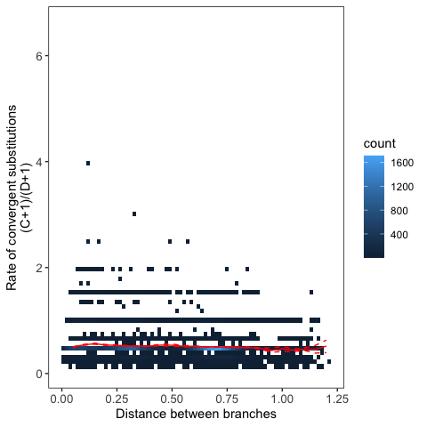
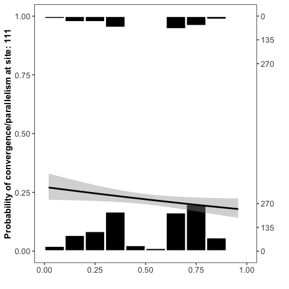
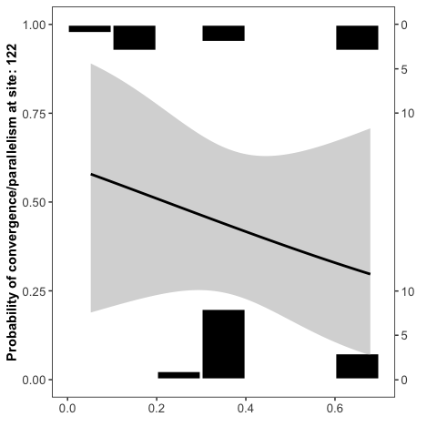
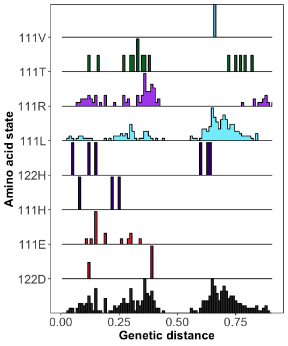

Phylogenetic convergence
================
Santiago Herrera
2023-04-22

Code to replicate figure 6:

-   `rst` file: contains the ASR output: posterior probabilities per site and reconstructed sequences (codeml - PAML)
-   `A1-A3_AA_alignment_convergence_modified_codeml.fasta` file: sequence alignment of ATP1A gene family
-   `codeml_brlens_tree.tre` file: phylogenetic tree of ATP1A gene family

Functions
---------

``` r
# imports a fasta-formatted alignment and converts it into a matrix
import_alignment <- function(dir) {
  
  fasta <- readLines(dir)
  
  taxa <- fasta[2L * (1L:(length(fasta) / 2L)) - 1L]
  taxa <- sub('>', '', taxa)
  
  sequences <- fasta[2L * (1L:(length(fasta) / 2L))]
  sequences <- t(vapply(strsplit(sequences, split = ''), identity, character(nchar(sequences[1L]))))
  rownames(sequences) <- taxa
  
  sequences
}


# given the PAML rst file (directory 'rst_dir'), extracts the ancestral sequences of the nodes in 'node_list'
# 'node_list' can be either integers or characters
import_ancestral_sequences <- function(rst_dir, node_list) {
  
  # for this code to work, the 'verbose' option in the PAML control file must be set to 2
  # this code is terrible so it will throw an error if you try to obtain the sequence for the highest number ancestral node
  
  # for each node you specify, this code will create a list with two objects:
  # one for the ML sequence, and the other for the posterior probability distribution
  
  sequences <- rep(NA_character_, length(node_list))
  pps <- rep(NA_character_,length(node_list))
  
  if(grepl("gz",rst_dir)){
    rst <- readLines(gzfile(rst_dir))
  }
  else {rst <- readLines(rst_dir)}

  rst <- rst[rst != '']
  
  for(i in 1L:length(node_list)) {
    begin <- grep(paste('Prob distribution at node', node_list[i]), rst) + 2L
    end <- grep(paste('Prob distribution at node', as.integer(node_list[i]) + 1L), rst) - 1L
    
    if(length(end) == 0L) end <- grep('Prob of best state at each node, listed by site', rst) - 1L
    
    rst_i <- rst[begin:end]
    ppdist <- matrix(0, nrow = length(rst_i), ncol = 20L)
    colnames(ppdist) <- c('A', 'R', 'N', 'D', 'C', 'Q', 'E', 'G', 'H', 'I', 'L', 'K', 'M', 'F', 'P', 'S', 'T', 'W', 'Y', 'V')
    
    for(j in 1L:length(rst_i)) {
      
      tmp <- strsplit(rst_i[j], split = ':')[[1L]][2L] #Extract amino acid states and PPs
      tmp <- strsplit(tmp, split = ' ')[[1L]][-1L]
      
      for(k in 1L:20L) ppdist[j, k] <- as.numeric(substr(tmp[k], 3L, 7L))
    }
    
    sequences[i] <- paste0(apply(ppdist, 1, function(x) colnames(ppdist)[which(x == max(x))[1]]), collapse = '')
    pps[i] <- paste0(apply(ppdist, 1, function(x) as.character(max(x)[1])), collapse = ',')
  }
  
  sequences <- t(vapply(strsplit(sequences, split = ''), identity, character(nchar(sequences[1L]))))
  row.names(sequences) <- as.character(node_list)
  pps <- t(vapply(strsplit(pps, split = ','), identity, character(length(gregexpr(",", pps, fixed = TRUE)[[1]])+1)))
  row.names(pps) <- as.character(node_list)
  
  return(list(sequences,pps))
}

# This functions retrieves the amino acid states for a set of nodes using a matrix (alignments) containing the reconstructed
# sequence and extant sequences. Site refers to the column of the alignment in each table for which the states
# are to be retrieved.
get_states_at_nodes_per_site <- function(branch_table,which_nodes,site,alignment,tree,pps){
  if(which_nodes=="anc") n <- 1
  if(which_nodes=="des") n <- 2
  nodes <- branch_table[,n]
  states <- c()
  
  for(i in 1:length(nodes)){
    s <- c()
    if(nodes[i]>length(tree$tip.label)){
      # filter amino acid states with posterior probability < 0.8
      if(as.numeric(pps[which(rownames(pps)==nodes[i]),site])<0.8) s <- NA
      else{
        node <- paste("node_",nodes[i],sep="")
        s <- as.character(alignment[rownames(alignment)==node,site])
      }
    }
    else if(nodes[i]<=length(tree$tip.label)){
      node <- tree$tip.label[nodes[i]]
      s <- as.character(alignment[rownames(alignment)==node,site])
    }
    states <- c(states,s)
  }
  return(states)
}

## This function perform all pairwise comparisons between branches and identifies the amino acid changes that occur along each branch at each site
branch_pairwise_comparisons_entire_prot <- function(branch_table,pdist_matrix,tree){
  
  end_branch_i <- c()
  end_branch_j <- c()
  #aa_distance <- c()
  convergence <- c()
  divergence <- c()
  total <- c()
  pdist <- c()
  for(i in 1:dim(branch_table)[1]){
    if(i==dim(branch_table)[1]) break
    
    subs_along_branch_i <- NULL
    sites_i <- NULL
    splice_region <- seq(834,864,1) # putative 30aa-long splice region
    for(k in 1:dim(anc_extant_align)[2]){
      if(k %in% splice_region) next #ignore site if falls within the spliced region
      b <- k+2
      e <- b + dim(anc_extant_align)[2]
      if(branch_table[i,b] == branch_table[i,e] || is.na(branch_table[i,b]) || is.na(branch_table[i,e])) next
      
      if(branch_table[i,b] != branch_table[i,e] && branch_table[i,b] != "-" && branch_table[i,e] != "-"){
        #if a substitution occurs in branch i at position k, continue:
        subs_site_k_i <- paste(branch_table[i,b],k,branch_table[i,e],sep="")
        subs_along_branch_i <- c(subs_along_branch_i,subs_site_k_i)
        sites_i <- c(sites_i,k)
      }
    }
    
    if(length(subs_along_branch_i)==0) next
    
    tmp <- branch_table[-c(1:i),]
    for(j in 1:dim(tmp)[1]){
      if(branch_table[i,2]==tmp[j,1] || branch_table[i,1]==tmp[j,1]){
        #if branch j comes immediately after branch i, or branches share the same ancestor, ignore:
        next
      }
      subs_along_branch_j <- NULL
      sites_j <- NULL
      for(k in 1:dim(anc_extant_align)[2]){
        if(k %in% splice_region) next  #ignore site if falls within the spliced region
        b <- k+2
        e <- b + dim(anc_extant_align)[2]
        if(tmp[j,b] == tmp[j,e] || is.na(tmp[j,b]) || is.na(tmp[j,e])) next
        
        if(tmp[j,b] != tmp[j,e] && tmp[j,b] != "-" && tmp[j,e] != "-"){
          #if a substitution occurs in branch j at position k, continue:
          subs_site_k_j <- paste(tmp[j,b],k,tmp[j,e],sep="")
          subs_along_branch_j <- c(subs_along_branch_j,subs_site_k_j)
          sites_j <- c(sites_j,k)
        }
      }
      
      if(length(subs_along_branch_j)==0) next
      
      branch_i_tip <- branch_table[i,2]
      branch_j_tip <- tmp[j,2]
      p <- pdist_matrix[branch_i_tip,branch_j_tip]
      mol_convergences <- NA_character_
      mol_divergences <- NA_character_
      
      mol_convergences <- sum(subs_along_branch_i %in% subs_along_branch_j)
      total_subs <- length(subs_along_branch_i)+length(subs_along_branch_j)
      same_sites <- sum(sites_i %in% sites_j)
      mol_divergences <- same_sites-mol_convergences
      
      pdist <- c(pdist,p)
      end_branch_i <- c(end_branch_i,branch_i_tip)
      end_branch_j <- c(end_branch_j,branch_j_tip)
      convergence <- c(convergence,mol_convergences)
      divergence <- c(divergence,mol_divergences)
      total <- c(total,total_subs)
    }
  }
  df <- data.frame(end_branch_i,end_branch_j,convergence,divergence,total,pdist)
  colnames(df) <- c("end_branch_i","end_branch_j","mol_convergences","mol_divergences","total_subs","patristic_dist")
  return(df)
}

# This function performes branch-pairwise comparisons for a particular site
branch_pairwise_comparisons_per_site <- function(branch_table,pdist_matrix,tree,b=3,e=4){

  end_branch_i <- c()
  end_branch_j <- c()
  convergence <- c()
  aa_state <- c()
  pdist <- c()
  for(i in 1:dim(branch_table)[1]){
    if(i==dim(branch_table)[1]) break
    
    if(branch_table[i,b] == branch_table[i,e] || is.na(branch_table[i,b]) || is.na(branch_table[i,e])){
      next
    }
    if(branch_table[i,b] != branch_table[i,e] && branch_table[i,b] != "-" && branch_table[i,e] != "-"){
      #if a substitution occurs in branch i, continue:
      subs_branch_i <- branch_table[i,e]
      tmp <- branch_table[-c(1:i),]
      for(j in 1:dim(tmp)[1]){
        if(tmp[j,b] == tmp[j,e] || is.na(tmp[j,b]) || is.na(tmp[j,e])){
          next
        }
        if(tmp[j,b] != tmp[j,e] && tmp[j,b] != "-" && tmp[j,e] != "-"){
          #if a substitution occurs in branch j, continue:
          if(branch_table[i,2]==tmp[j,1] || branch_table[i,1]==tmp[j,1]){
            #if branch j comes immediately after branch i, or branches share the same ancestor, ignore:
            next
          }
          subs_branch_j <- tmp[j,e]
          c <- 0
          s <- NA
          if(subs_branch_i==subs_branch_j){
            c <- 1 #convergence event
            s <- subs_branch_i #molecular convergence
          }
          branch_i_tip <- branch_table[i,2]
          branch_j_tip <- tmp[j,2]
          p <- pdist_matrix[branch_i_tip,branch_j_tip]
          
          convergence <- c(convergence,c)
          pdist <- c(pdist,p)
          end_branch_i <- c(end_branch_i,branch_i_tip)
          end_branch_j <- c(end_branch_j,branch_j_tip)
          aa_state <- c(aa_state,s)
        }
      }
    }
  }
  df <- data.frame(end_branch_i,end_branch_j,convergence,pdist,aa_state)
  colnames(df) <- c("end_branch_i","end_branch_j","convergence","patristic_dist","aa_state")
  return(df)
}

# Get density of points in 2 dimensions.
# @param x A numeric vector.
# @param y A numeric vector.
# @param n Create a square n by n grid to compute density.
# @return The density within each square.
get_density <- function(x, y, ...) {
  dens <- MASS::kde2d(x, y, h = c(ifelse(bandwidth.nrd(x) == 0, 0.1, bandwidth.nrd(x)),
                                  ifelse(bandwidth.nrd(y) == 0, 0.1, bandwidth.nrd(y))))
  ix <- findInterval(x, dens$x)
  iy <- findInterval(y, dens$y)
  ii <- cbind(ix, iy)
  return(dens$z[ii])
}
```

Import data
-----------

Import ASR dataset (codeml output), the alignment of ATP1A gene family, and extract the reconstructed ancestral sequences with the posterior probabilities per site.

``` r
# Codeml output tree: tree with annotated nodes (from `rst` file)
tree_asr <- ape::read.tree("../data/codeml/asr_codeml__nodes_tree.tre") 
nodes <- tree_asr$node.label

# `rst` file
rst_file <- "../data/codeml/rst.gz"

# Import ancestral sequences and posterior probabilities distributions
f1 <- file.path("..", "data", "convergence", "anc_seqs_atp1-3_codeml.csv")
f2 <- file.path("..", "data", "convergence", "pps_anc_seqs_atp1-3_codeml.csv")
if(!file.exists(f1) & !file.exists(f2)) {
  asr <- import_ancestral_sequences(rst_file,nodes)
  aln_anc <- asr[[1]]
  pps_per_site_anc <- asr[[2]]
  
  write.csv(aln_anc,f1,quote = F)
  write.csv(pps_per_site_anc,f2,quote = F)
} else {
    aln_anc <- read.csv(f1,h=TRUE,colClasses="character",row.names = 1)
    rownames(aln_anc) <- paste("node_",rownames(aln_anc),sep="")
    pps_per_site_anc <- read.csv(f2,row.names = 1)
}

# Import alignment of extant sequences
alignment <- "../data/alignments/A1-A3_AA_alignment_convergence_modified_codeml.fasta"
aln <- import_alignment(alignment)
colnames(aln) <- colnames(aln_anc)

# Merge ancestral and extant alignments
anc_extant_align <- rbind(aln,aln_anc)
rownames(anc_extant_align) <- gsub("(lungfish|fish|caecilian|frog|lizard|snake|bird|crocodilian|mammal|turtle)(\\.)","\\1|",rownames(anc_extant_align)) %>%
  gsub("_A1.1","_A1_2",.)

# Import phylogenetic tree
tree<-read.tree("../data/convergence/codeml_brlens_tree.tre")
edges <- as.data.frame(tree$edge) # matrix with edges: anc --> desc nodes
colnames(edges) <- c("anc_node","descendant_node")
```

Check ASR results
-----------------

Check quality of ASR: 1) the mean posterior probabilities (PPs) per site, and 2) the number of sites in each PP category.

``` r
pps <- pps_per_site_anc

# Compute mean posterior probability per site across all ancestral sequences
mean_pp <- matrix(nrow = 1,ncol=1039,data = NA)
for(i in 1:dim(mean_pp)[2]){
  m <- mean(pps[,i])
  mean_pp[1,i] <- m
}

mean_pp <- as.data.frame(mean_pp)
mean_pp_anc <- as.data.frame(t(mean_pp))
mean_pp_anc$site <- seq(1,1039,1)
colnames(mean_pp_anc) <- c("pp","site")

#mean PPs per site
anc_pps <- ggplot(data=mean_pp_anc,aes(x=site,y=pp)) + geom_point(size=0.5) + geom_line() + xlab("") + ylab("") +
  theme(panel.background = element_rect(fill = "white", colour = "black"), 
        panel.grid.major = element_blank(), panel.grid.minor = element_blank(), 
        axis.text.x = element_text(face="bold", size=8),axis.text.y = 
          element_text(face="bold", size=9), axis.title.y = 
          element_text(face="bold", size=15),axis.title.x = 
          element_text(face="bold", size=15), plot.title = element_text(size=9)) + 
  geom_hline(yintercept=0.8, linetype="dashed",color = "red") +ggtitle("Mean PP for 829 anc. seqs (JTT+I+G4+F)") + 
  xlab("Site") + ylab("mean PP")

# barplot of PP classes
anc_pps2 <- mean_pp_anc %>% mutate(b=cut(pp, breaks=c(0,0.2,0.4,0.6,0.8,1))) %>%
  group_by(b) %>% summarize(count=n()) %>%
  ggplot(aes(x=b,y=count)) + geom_bar(stat="identity") +
  theme(panel.background = element_rect(fill = "white", colour = "black"), 
        panel.grid.major = element_blank(), panel.grid.minor = element_blank(), 
        axis.text.x = element_text(face="bold", size=8),axis.text.y = 
          element_text(face="bold", size=9), axis.title.y = 
          element_text(face="bold", size=15),axis.title.x = 
          element_text(face="bold", size=15), plot.title = element_text(size=9)) +
  xlab("PP class") + ylab("number of sites")
```

    ## `summarise()` ungrouping output (override with `.groups` argument)

``` r
anc_pps + anc_pps2
```


Phylogenetic pairwise comparison
--------------------------------

Here we will extract the substitutions per site per branch and perform the pairwise comparisons. First, we modify the `edges` data frame to include the ancestral and derived states along each branch for every site in the protein. Then, we use this new data set to compute all the amino acid changes along every pair of branches in the phylogeny

``` r
# Get states at anc and des nodes for all sites
if(!file.exists(file.path("..", "data", "convergence", "convergence_total.RData"))) {
  cores=detectCores()
  cl <- parallel::makeCluster(cores[1]-1,"SOCK")
  doParallel::registerDoParallel(cl)

  x <- foreach(i = 1:dim(anc_extant_align)[2],.combine = 'cbind') %dopar% {
    get_states_at_nodes_per_site(edges,"anc",i,anc_extant_align,tree,pps_per_site_anc)
  }

  y <- foreach(i = 1:dim(anc_extant_align)[2],.combine = 'cbind') %dopar% {
    get_states_at_nodes_per_site(edges,"des",i,anc_extant_align,tree,pps_per_site_anc)
  }

  stopCluster(cl)

  edges <- cbind(edges,x,y)

  colnames(edges) <- c("anc_node","descendant_node",
                     c(lapply(rep("anc",1040),FUN = function(x) paste(x,seq(1:1040),sep=""))[[1]]),
                     c(lapply(rep("des",1040),FUN = function(x) paste(x,seq(1:1040),sep=""))[[1]]))

  rownames(edges) <- NULL
  
  ## Perform all pairwise comparisons between branches
  pdist_nodes <- dist.nodes(tree) # get patristic distances for every pair of nodes (expected number of substitutions per site)

  molecular_convergence_a1_3 <- branch_pairwise_comparisons_entire_prot(edges,pdist_nodes,tree)
  save.image("../data/convergence/convergence_total.RData")
} else { 
  # Load R workspace with results from previous section
  load("../data/convergence/convergence_total.RData")
}
```

Global trend in convergence rate
================================

Plot the relationship between the rate of protein-wide convergence per site across the phylogeny as a function of genetic distance (expected number of substitutions per site). Show the rate of convergence for sites 111 and 122 individually.

``` r
m <- molecular_convergence_a1_3
m$c_d <- (m$mol_convergences+1)/(m$mol_divergences+1)
m <- m[m$mol_divergences>quantile(m$mol_divergences,0.25),]

m$density <- get_density(m$patristic_dist, m$c_d , n = 100)

intervals <- seq(0,max(m$patristic_dist),0.05)
medians <- c()
higher <- c()
lower <- c()
for(i in 1:length(intervals)-1){
  d <- m[m$patristic_dist>intervals[i],]
  d <- d[d$patristic_dist<=intervals[i+1],]
  me <- mean(d$c_d)
  medians <- c(medians,me)
  sampled_means <- c()
  for(i in 1:100){
    d_i <- dplyr::sample_frac(d, 0.9, replace = TRUE)
    sm <- mean(d_i$c_d)
    sampled_means <- c(sampled_means,sm)
  }
  h <- quantile(sampled_means,0.95,na.rm = TRUE)
  l <- quantile(sampled_means,0.05,na.rm = TRUE)
  higher <- c(higher,h)
  lower <- c(lower,l)
}
intervals <- intervals[-1]
medians <- medians[-1]
higher <- higher[-1]
lower <- lower[-1]
df1 <- data.frame(intervals,medians,lower,higher)

# PLOT
ggplot(m,aes(x=patristic_dist,y=c_d)) +
  stat_bin_2d(bins = 75) +
  scale_color_viridis() +
  scale_y_continuous(limits = c(min(m$c_d),max(m$c_d))) +
  geom_line(data=df1,aes(x=intervals,y=medians),color="red") +
  geom_line(data=df1,aes(x=intervals,y=lower),color="red",linetype = "dashed") +
  geom_line(data=df1,aes(x=intervals,y=higher),color="red",linetype = "dashed") +
  theme(panel.background = element_rect(fill = "white", colour = "black"), 
        panel.grid.major = element_blank(), 
        panel.grid.minor = element_blank(),
        axis.text.y = element_text(size=10),
        axis.text.x = element_text(size=10)) + 
  labs(y = "Rate of convergent substitutions\n(C+1)/(D+1)", x = "Distance between branches")
```



``` r
############################################
# Rates of convergence for sites 111 and 122
pos_111_122 <- anc_extant_align[,134:146] %>% dplyr::select(.,V134,V146)
pps_111_122 <- pps_per_site_anc[,134:146] %>% dplyr::select(.,V134,V146)

edges2 <- as.data.frame(tree$edge)
colnames(edges2) <- c("anc_node","descendant_node")
anc_111 <- get_states_at_nodes_per_site(edges2,"anc",1,pos_111_122,tree,pps_111_122)
des_111 <- get_states_at_nodes_per_site(edges2,"des",1,pos_111_122,tree,pps_111_122)
anc_122 <- get_states_at_nodes_per_site(edges2,"anc",2,pos_111_122,tree,pps_111_122)
des_122 <- get_states_at_nodes_per_site(edges2,"des",2,pos_111_122,tree,pps_111_122)

edges2$anc_111 <- anc_111
edges2$des_111 <- des_111
edges2$anc_122 <- anc_122
edges2$des_122 <- des_122

pairwise_comp_111 <- branch_pairwise_comparisons_per_site(branch_table = edges2,pdist_matrix = pdist_nodes,tree = tree,b=3,e=4)
pairwise_comp_122 <- branch_pairwise_comparisons_per_site(branch_table = edges2,pdist_matrix = pdist_nodes,tree = tree,b=5,e=6)

plot_hist_site <- function(df,site){
  logihist(df$patristic_dist,df$convergence,colob="white",
           pglm = TRUE, se = TRUE, ylab2 = "") +
    labs(y = paste("Probability of convergence/parallelism at site: ",site,sep=""), x = "") +
    theme(panel.background = element_rect(fill = "white", colour = "black"), 
          panel.grid.major = element_blank(), 
          panel.grid.minor = element_blank(),
          axis.title.y = element_text(face="bold"),
          axis.text.y = element_text(size=10),
          axis.text.x = element_text(size=10))
}

plot_hist_site(pairwise_comp_111,"111")
```

    ## `geom_smooth()` using formula 'y ~ x'



``` r
plot_hist_site(pairwise_comp_122,"122")
```

    ## `geom_smooth()` using formula 'y ~ x'



``` r
# logistic regression
m1 <- glm(pairwise_comp_111$convergence ~ pairwise_comp_111$patristic_dist, binomial)
summary(m1)
```

    ## 
    ## Call:
    ## glm(formula = pairwise_comp_111$convergence ~ pairwise_comp_111$patristic_dist, 
    ##     family = binomial)
    ## 
    ## Deviance Residuals: 
    ##     Min       1Q   Median       3Q      Max  
    ## -0.7944  -0.7326  -0.6730  -0.6501   1.8430  
    ## 
    ## Coefficients:
    ##                                  Estimate Std. Error z value Pr(>|z|)    
    ## (Intercept)                       -0.9800     0.1502  -6.526 6.74e-11 ***
    ## pairwise_comp_111$patristic_dist  -0.5673     0.2737  -2.073   0.0382 *  
    ## ---
    ## Signif. codes:  0 '***' 0.001 '**' 0.01 '*' 0.05 '.' 0.1 ' ' 1
    ## 
    ## (Dispersion parameter for binomial family taken to be 1)
    ## 
    ##     Null deviance: 1451.3  on 1376  degrees of freedom
    ## Residual deviance: 1447.0  on 1375  degrees of freedom
    ## AIC: 1451
    ## 
    ## Number of Fisher Scoring iterations: 4

``` r
m3 <- glm(pairwise_comp_122$convergence ~ pairwise_comp_122$patristic_dist, binomial)
summary(m3)
```

    ## 
    ## Call:
    ## glm(formula = pairwise_comp_122$convergence ~ pairwise_comp_122$patristic_dist, 
    ##     family = binomial)
    ## 
    ## Deviance Residuals: 
    ##     Min       1Q   Median       3Q      Max  
    ## -1.1215  -1.0859  -0.8753   1.1195   1.5219  
    ## 
    ## Coefficients:
    ##                                  Estimate Std. Error z value Pr(>|z|)
    ## (Intercept)                        0.4151     1.0193   0.407    0.684
    ## pairwise_comp_122$patristic_dist  -1.8788     2.4809  -0.757    0.449
    ## 
    ## (Dispersion parameter for binomial family taken to be 1)
    ## 
    ##     Null deviance: 28.682  on 20  degrees of freedom
    ## Residual deviance: 28.089  on 19  degrees of freedom
    ## AIC: 32.089
    ## 
    ## Number of Fisher Scoring iterations: 4

Convergent derived states along the genetic distance axis
---------------------------------------------------------

For sites 111 and 122, extract each substitution and plot the frequency of convergence events along the sequence divergence axis (expected number of substitutions per site)

``` r
# Combine amino acid subs. datasets for sites 111 and 122
pairwise_comp_111$site <- rep("111",dim(pairwise_comp_111)[1])
pairwise_comp_122$site <- rep("122",dim(pairwise_comp_122)[1])
pairwise_comp_122$aa_state <- as.factor(gsub(pattern = "H",replacement = "H2",x = pairwise_comp_122$aa_state))
df_combined <- rbind(pairwise_comp_111,pairwise_comp_122)

df <- df_combined[!is.na(df_combined$aa_state),] %>% dplyr::filter(.,aa_state != "Q")
ggplot(df) +
  geom_density_ridges2(aes(x=patristic_dist,y=aa_state,group = aa_state, fill = aa_state,height = ..ndensity..), stat = "binline", binwidth = 0.01,scale=0.95) +
  scale_fill_cyclical(values=c("#ad1d2d","#d23c3d","#3e0a77","#3e0a77","#82eefd","#b056ef","#006D2C","#6BAED6"),
                      labels=c("122D","111E","111H","122H","111L","111R","111T","111V")) +
  geom_histogram(aes(x=patristic_dist,y=..count../max(..count..)),fill="#323232",colour="black",binwidth = 0.01) +
  labs(y = "Amino acid state", x = "Genetic distance") +
  scale_y_discrete(labels=c("122D","111E","111H","122H","111L","111R","111T","111V")) +
  scale_x_continuous(limits = c(0, max(df$patristic_dist))) +
  theme(panel.background = element_rect(fill = "white", colour = "black"), 
        panel.grid.major = element_blank(), 
        panel.grid.minor = element_blank(),
        axis.title.y = element_text(face="bold",size=15),
        axis.title.x = element_text(face="bold",size=15),
        axis.text.y = element_text(size=15),
        axis.text.x = element_text(size=15))
```



``` r
# Branches where convergent events ocurred (e.g. branches where 111R ocurred)
# branches_111R <- union(df[df$aa_state=="R",]$end_branch_i,df[df$aa_state=="R",]$end_branch_j)
#
# number of pairwise comparisons per convergent substitution
# choose(length(branches_111R),k = 2) # same as (n(n-1))/2
```
